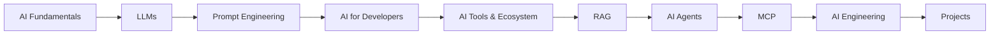

# Namaste AI Notes

> My personal notes from the [Namaste AI](https://namastedev.com/learn/namaste-ai) course by [Akshay Saini](https://www.linkedin.com/in/akshaymarch7/) — explored one episode at a time, in my own words.

Notes by [Ram Mandal](https://www.linkedin.com/in/rvmandal/).

## About

This repository is my public learning journal for the Namaste AI course. Each episode note is organized into two kinds of content:

- **Course content** — what the episode teaches: key concepts, deep dives, and takeaways, written neutrally and technically
- **Personal notes** — how I understand it: mental models, analogies, engineering connections, and open questions, shared from my own perspective

The course is **high-level AI** — LLMs, prompt engineering, RAG, AI agents, MCP, and AI engineering. It does not go deep into ML math, neural network internals, or model training; the focus is on building with AI.

> These are **personal learning notes** and they are **not a replacement for the actual course.**

## Course Roadmap

The course covers 10 topics in sequence:

## Seasons

### Season 1 — Inside the Mind of AI

See the **[Season 1 overview](./season-1-inside-the-mind-of-ai/README.md)** for episode details and status.

### Season 2 — AI Native Software Engineer

Coming soon...

### Season 3 — Building AI Applications

Coming soon...

### Season 4 — Giving AI Knowledge (RAG)

Coming soon...

### Season 5 — From Chatbots To Agents

Coming soon...

## Projects & Experiments

Hands-on projects built alongside the course live in **[projects/](./projects/README.md)**.

## Resources

Curated external links and references: **[resources/useful-links.md](./resources/useful-links.md)**

## Contributing

Spotted a correction, a clearer way to explain something, or an idea worth adding? Help these notes grow by opening an issue or pull request.

## Repository Structure

- `season-1-inside-the-mind-of-ai/` — Season 1 episode notes
- `projects/` — Hands-on projects
- `assets/` — Diagrams and visual aids
- `resources/` — External links and references

