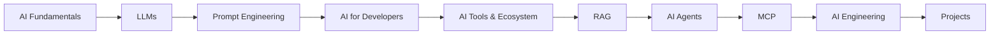

# Namaste AI Notes

[](LICENSE)
[](https://github.com/ram-mandal/namaste-ai-notes)
[](CONTRIBUTING.md)

> Welcome! 👋 These are comprehensive, beginner-friendly learning notes on AI concepts based on the [Namaste AI](https://namastedev.com/learn/namaste-ai) course by [Akshay Saini](https://www.linkedin.com/in/akshaymarch7/).

**Created & maintained by [Ram Mandal](https://www.linkedin.com/in/rvmandal/) — open for community contributions**

## What You'll Learn

These notes explain **how AI actually works** — starting from the ground up with LLMs, prompt engineering, RAG, AI agents, MCP, and AI engineering. Written for beginners but with real depth: no ML math or backprop deep-dives, just practical understanding of how to work with AI.

- 🧠 **How LLMs think** — tokens, embeddings, attention, transformers
- 💬 **How to prompt AI effectively** — prompt engineering techniques
- 🔍 **How AI learns from data** — RAG (Retrieval-Augmented Generation)
- 🤖 **How to build AI agents** — autonomous systems and workflows
- 🔌 **MCP protocol** — connecting AI to external tools
- 🛠️ **AI engineering practices** — building reliable AI systems

## Who Is This For?

✅ **Great if you:**
- Want to understand AI concepts without heavy math
- Are a developer learning to build with AI
- Prefer simple explanations with real depth
- Like learning sequentially (not jumping around)
- Enjoy taking time to reflect on what you learn

❌ **Not the right fit if you:**
- Want to train neural networks from scratch
- Are looking for research-level ML theory
- Prefer quick, shallow summaries
- Want to binge-learn in a weekend

## About

The notes cover **high-level AI** — LLMs, prompt engineering, RAG, AI agents, MCP, and AI engineering. No deep ML math or model training; the focus is on **building with AI**.

## Course Roadmap

The notes are organized around these topics:



## Frequently Asked Questions

**Q: What's the best way to use these notes?**  
A: Follow the [Namaste AI course](https://namastedev.com/learn/namaste-ai) sequentially. After each episode video, review the corresponding notes here to reinforce understanding. Pause between episodes, rewatch the videos if needed, and make your own notes too. The course is designed for slow, intentional learning over 2–4 months.

**When to refer to these notes:**
- **As you learn the course** — take notes alongside watching to reinforce understanding
- **After completing each episode** — review the notes as a summary and reference
- **When building AI projects** — jump to specific episodes for quick refreshers (e.g., "How does RAG work?" or "What are embeddings?")
- **When explaining AI to others** — use the simple explanations as a template for your own teaching
- **Before reading research papers or docs** — build foundational knowledge first

**How it helps:**
- 🎯 **Clarifies concepts** — AI explained without jargon or heavy math
- 📖 **Saves time** — pre-digested course content in structured notes
- 🔍 **Searchable reference** — find specific topics quickly (tokens, embeddings, attention, RAG, MCP, agents)
- 💡 **Different learning style** — text + visuals + mental models for multiple ways to understand
- 🧠 **Retention** — taking notes yourself + reviewing reinforces learning far better than passive watching

**Q: What's an LLM in simple words?**  
A: An LLM (Large Language Model) is a computer program trained on massive amounts of text that learns to predict the next word. That's how it generates responses to your prompts. See [Episode 3](./season-1-inside-the-mind-of-ai/episode-03-does-chatgpt-know-or-does-it-guess.md) and [Episode 4](./season-1-inside-the-mind-of-ai/episode-04-the-secret-language-of-llms.md) for deep dives.

**Q: What is RAG? Do I need to know it?**  
A: RAG (Retrieval-Augmented Generation) is a technique that lets AI systems pull in external information before answering your question. It's powerful for specialized knowledge. Coming in Season 4.

**Q: What is MCP?**  
A: The Model Context Protocol (MCP) is a new standard that lets AI assistants connect to external tools, databases, and services. It's how AI becomes useful beyond text. See Season 1 episodes for foundations.

**Q: Can I contribute?**  
A: Absolutely! See [CONTRIBUTING.md](CONTRIBUTING.md) for guidelines.

## All Episodes

### Season 1 — Inside the Mind of AI

1. 📖 [Episode 1: Welcome to Namaste AI](./season-1-inside-the-mind-of-ai/episode-01-welcome-to-namaste-ai.md) — Course overview and learning philosophy
2. 📈 [Episode 2: The Evolution of AI](./season-1-inside-the-mind-of-ai/episode-02-the-evolution-of-ai.md) — How AI has developed over time
3. 🤔 [Episode 3: Does ChatGPT Know or Does It Guess?](./season-1-inside-the-mind-of-ai/episode-03-does-chatgpt-know-or-does-it-guess.md) — How ChatGPT produces answers
4. 🔤 [Episode 4: The Secret Language of LLMs](./season-1-inside-the-mind-of-ai/episode-04-the-secret-language-of-llms.md) — Tokens, embeddings, and context windows
5. 🧮 [Episode 5: How Machines Represent Meaning](./season-1-inside-the-mind-of-ai/episode-05-how-machines-represent-meaning.md) — Vectorization, embeddings, and semantic similarity
6. 🧠 [Episode 6: The Computational Brain of Machines](./season-1-inside-the-mind-of-ai/episode-06-the-computational-brain-of-machines.md) — Transformers, attention, and the forward pass
7. ⚡ [Episode 7: Sharpening the Brain](./season-1-inside-the-mind-of-ai/episode-07-sharpening-the-brain.md) — Training, loss, backpropagation, and gradient descent
8. 🚧 Episode 8: From a Base Model to an AI Assistant — _coming soon_
9. 🤷 Episode 9: Can AI Really Think? — _coming soon_

### Season 2 — AI Native Software Engineer

Coming soon...

### Season 3 — Building AI Applications

Coming soon...

### Season 4 — Giving AI Knowledge (RAG)

Coming soon...

### Season 5 — From Chatbots To Agents

Coming soon...

## Contributing

Have a question, found a typo, or want to clarify something? **[See CONTRIBUTING.md](CONTRIBUTING.md)** for guidelines.

These notes are a living document — your feedback makes them better. 🙏

## Repository Structure

```
.
├── season-1-inside-the-mind-of-ai/    Episode notes for Season 1
├── season-2-... (future)               Season 2 notes
├── assets/                             Diagrams and visual aids
├── projects/                           Hands-on projects & experiments
├── resources/                          External links and references
├── .github/copilot-instructions.md     Content style & conventions guide
├── CONTRIBUTING.md                     How to contribute
└── README.md                           This file
```

## Quick Links

- 🏠 **[Home](README.md)** — You are here
- 📚 **[Season 1 Episodes](./season-1-inside-the-mind-of-ai/)** — 7 complete episodes
- 🔨 **[Projects](./projects/README.md)** — Hands-on code and experiments
- 🔗 **[External Resources](./resources/useful-links.md)** — Curated AI learning links
- 📖 **[Course](https://namastedev.com/learn/namaste-ai)** — Official course by Akshay Saini
- 📝 **[Contributing](CONTRIBUTING.md)** — How to help improve these notes
- 📄 **[License](LICENSE)** — MIT License

## About the Course & Attribution

These notes are **supplementary learning material** for the [**Namaste AI**](https://namastedev.com/learn/namaste-ai) course created by **[Akshay Saini](https://www.linkedin.com/in/akshaymarch7/)**.

**Course Credit:** All course content, structure, and teaching methodology are © Namaste AI by Akshay Saini.  
**Notes & Organization:** Compiled and maintained by [Ram Mandal](https://www.linkedin.com/in/rvmandal/) with community contributions.  
**License:** Notes are shared under MIT license for educational purposes. Always refer to the [official course](https://namastedev.com/learn/namaste-ai) for authoritative course content.

**How to use these notes properly:**
1. Watch the [official course videos](https://namastedev.com/learn/namaste-ai)
2. Use these notes as a reference and reinforcement tool
3. Make your own notes alongside the course
4. Refer back to the official course if anything is unclear

## Learning Philosophy

> **Slow, Intentional Learning Over Quick Consumption**

- **Pause between episodes** — take time to reflect
- **Rewatch if needed** — understanding matters more than speed
- **Make your own notes** — writing reinforces learning
- **Give yourself 2–4 months** — quality learning takes time
- **No binge-watching** — this isn't a Netflix series

## Support

If these notes helped you, please **star the repo** ⭐ to help others find it. Questions or ideas? **[Open an issue](https://github.com/ram-mandal/namaste-ai-notes/issues)**.

---

**Made with 💜 for anyone curious about how AI works.**
