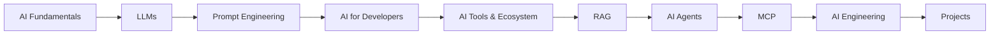

# Namaste AI Notes

> My personal learning journey through the [Namaste AI](https://www.namasteai.com/) course by Akshay Saini — episode by episode, in my own words.

## About

This repository is my public learning journal for the Namaste AI course. Each episode note is organized into two kinds of content:

- **Course content** — what the episode teaches: key concepts, deep dives, and takeaways, written neutrally and technically
- **Personal notes** — how *I* understand it: mental models, analogies, engineering connections, and open questions, written in first person

The course is **high-level AI** — LLMs, prompt engineering, RAG, AI agents, MCP, and AI engineering. It does not cover ML math, neural networks, or model training; the focus is on building *with* AI.

> ⚠️ These are **personal learning notes, not official course material.** They are not affiliated with or endorsed by the course.

## Course Roadmap

The course covers 10 topics in sequence:

## Seasons & Episodes

### Season 1 — Inside the Mind of AI

| # | Episode | Status |
|:---:|:---|:---:|
| 01 | [Welcome to Namaste AI](./season-1-inside-the-mind-of-ai/episode-01-welcome-to-namaste-ai.md) | ✅ |
| 02 | [The Evolution of AI](./season-1-inside-the-mind-of-ai/episode-02-the-evolution-of-ai.md) | 🚧 |

**[Season 1 Overview](./season-1-inside-the-mind-of-ai/README.md)** · Legend: ✅ complete · 🚧 in progress · ⬜ not started

### Season 2+

Coming soon...

## Projects & Experiments

Hands-on projects built alongside the course live in **[projects/](./projects/README.md)**.

## Resources

Curated external links and references: **[resources/useful-links.md](./resources/useful-links.md)**

## Repository Structure

- `season-1-inside-the-mind-of-ai/` — Season 1 episode notes
- `projects/` — Hands-on projects
- `assets/` — Diagrams and visual aids
- `resources/` — External links and references

