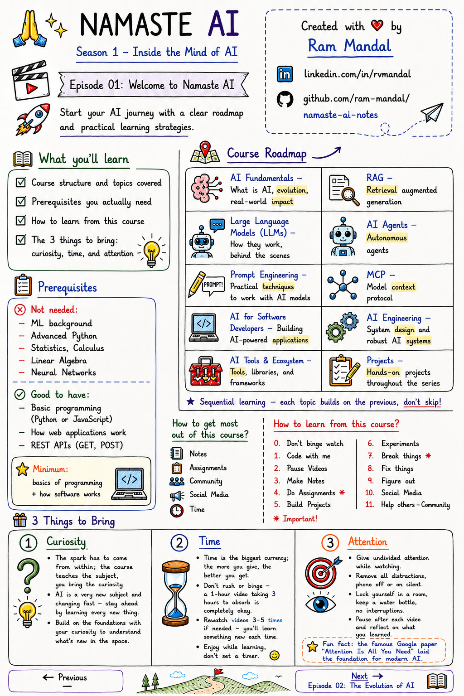

# Season 1 — Episode 01: Welcome to Namaste AI

> Start your AI journey with a clear roadmap and practical learning strategies.

---

## What you'll learn

- Course structure and topics covered
- Prerequisites you actually need
- How to learn from this course
- The 3 things to bring: curiosity, time, and attention

---

📝 Notes at a Glance (click to expand)

---

## Course Roadmap

| | |
|:---|:---|
| **AI Fundamentals** — What is AI, evolution, real-world impact | **RAG** — Retrieval augmented generation |
| **Large Language Models (LLMs)** — How they work, behind the scenes | **AI Agents** — Autonomous agents |
| **Prompt Engineering** — Practical techniques to work with AI models | **MCP** — Model context protocol |
| **AI for Software Developers** — Building AI-powered applications | **AI Engineering** — System design and robust AI systems |
| **AI Tools & Ecosystem** — Tools, libraries, and frameworks | **Projects** — Hands-on projects throughout the series |

- Sequential learning — each topic builds on the previous, don't skip

---

## Prerequisites

**Not needed:** ML background, advanced Python, statistics, calculus, linear algebra, neural networks

**Good to have:**
- Basic programming (Python or JavaScript)
- How web applications work
- REST APIs (GET, POST)

> **Minimum:** basics of programming + how software works

---

## How to get most out of this course?

- Notes
- Assignments
- Community
- Social Media
- Time

## How to learn from this course?

| | |
|:---|:---|
| - 0. Don't binge watch | - 6. Experiments |
| - 1. Code with me | - 7. Break things * |
| - 2. Pause Videos | - 8. Fix things |
| - 3. Make Notes | - 9. Figure out |
| - 4. Do Assignments * | - 10. Social Media |
| - 5. Build Projects | - 11. Help others - Community |

## 3 Things to Bring

- **Curiosity** — the spark has to come from within; the course teaches the subject, you bring the curiosity
  - AI is a very new subject and changing fast — stay ahead by learning every new thing
  - Build on the foundations with your curiosity to understand what's new in the space
- **Time** — Time is the biggest currency; the more you give, the better you get
  - Don't rush or binge — a 1-hour video taking 3 hours to absorb is completely okay
  - Rewatch videos 3-5 times if needed — you'll learn something new each time
  - Enjoy while learning, don't set a timer
- **Attention** — give undivided attention while watching
  - Remove all distractions, phone off or on silent
  - Lock yourself in a room, keep a water bottle, no interruptions
  - Pause after each video and reflect on what you learned
  - Fun fact: the famous Google paper "Attention Is All You Need" laid the foundation for modern AI

---

| ← Previous | Next → |
|:---:|:---:|
| — | [Episode 02: The Evolution of AI](./episode-02-the-evolution-of-ai.md) |

