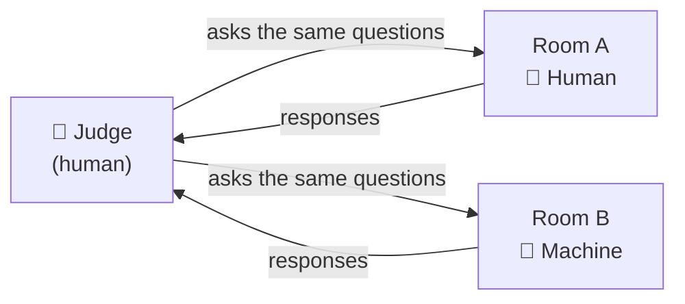

# Season 1 — Episode 02: The Evolution of AI

> Where the journey of AI began and how we have evolved so far — a high-level overview of where the AI industry stands today.

---

## What you'll learn

- What is Artificial Intelligence?
- Why AI was difficult for decades
- Why Machine Learning became necessary
- Why Deep Learning changed everything
- How Transformers revolutionized AI
- How LLMs became popular
- Why Agentic AI is the next evolution

---

## What is Artificial Intelligence?

**Definition:** AI is the science of making machines perform tasks that normally require human intelligence.

- A person is considered intelligent if they can **think and make decisions** — if a machine can do that, it's AI
- There is no single "proper" definition of AI — this framing is the practical one to use

### Is it AI? — Examples

| | |
|:---|:---|
| - Playing chess | - Writing poems |
| - Detecting spam in email | - Generating fictional images (e.g. a selfie with a celebrity) |
| - Recommending movies | - Driving a car (self-driving) |

> All of these require some form of intelligence — so yes, all of them are AI.

### Why AI matters right now

- **9 out of the top 10 companies by market cap** are betting heavily on AI: NVIDIA, Apple, Alphabet, Microsoft, Amazon, Meta, Broadcom, Tesla, TSMC (the exception: Saudi Aramco — an oil company)
- New models and tools are released **every day** — coding models, image generation, video, NLP
- Every company and venture capitalist is investing in AI; a lot of research is ongoing
- We are in the middle of a tech **revolution** — the biggest money in the world is flowing into AI

### Why learn the history?

- The AI tools we use today have a very interesting background (~70 years of evolution)
- Understanding where AI came from helps you build a **mental model** of how it evolved
- This episode sets the foundation for everything that follows — worth your full attention

---

## The Early Days: 1950–1955

> AI is a very new subject in computer science — computer science existed long before it. And AI has survived multiple **hype cycles**: hype rises, hype dies (the "AI winters"), hype rises again. Today we're in a hype phase that doesn't look like it's dying anytime soon.

### 1950 — Can Machines Think?

Before 1950, machines were only used for **computation** — heavy mathematical operations, done fast. Everybody wanted machines to be faster and better, but nobody asked the deeper question:

> **Can machines think?**

This question was asked by mathematician **Alan Turing** in 1950 — and it sparked the field.

> 📷 Alan Turing (1951) — Elliott & Fry, [Public Domain](https://commons.wikimedia.org/wiki/File:Alan_turing_header.jpg), via Wikimedia Commons

#### The Turing Test (Imitation Game)

"Can a machine think?" has no proper definition of *think* — so how do you test it? Turing's answer: the **Turing Test**, based on the **Imitation Game**.

- A **judge** (human) sits in a separate room
- **Room A** contains a human, **Room B** contains a machine — the judge doesn't know which is which
- The judge asks the **same questions** to both and studies the responses
- If the judge **cannot distinguish** the machine from the human → the machine **passes** the test

> If a machine passes the Turing Test, human and machine become **indistinguishable** — that was the 1950 answer to "can machines think?"

### 1955 — The Term "Artificial Intelligence" Is Coined

Computer scientist **John McCarthy** coined the term **Artificial Intelligence** in 1955 — the first time the word was used.

> 📷 John McCarthy (2006) — photo by [null0](https://www.flickr.com/photos/null0/272015955/), [CC BY-SA 2.0](https://creativecommons.org/licenses/by-sa/2.0/), via [Wikimedia Commons](https://commons.wikimedia.org/wiki/File:John_McCarthy_Stanford.jpg)

Researchers came together with an ambitious belief:

> **"Every aspect of learning and intelligence could, in principle, be described precisely enough for a machine to simulate it."**

- A very bold statement — made **70 years ago**, when there was no compute, no GPUs, and no data
- McCarthy could not have imagined that in 2025, AI would be a whole industry and everyone would be using the word he coined

---

## Why AI was difficult for decades

_(coming soon)_

---

## Why Machine Learning became necessary

_(coming soon)_

---

## Why Deep Learning changed everything

_(coming soon)_

---

## How Transformers revolutionized AI

_(coming soon)_

---

## How LLMs became popular

_(coming soon)_

---

## Why Agentic AI is the next evolution

_(coming soon)_

---

## Key Takeaways

- _(coming soon)_

---

## Resources

- [Full Season 1 Overview](./README.md)
- [External Resources](../resources/useful-links.md)

---

**Status:** Episode 02 in progress

---

| ← Previous | Next → |
|:---:|:---:|
| [Episode 01: Welcome to Namaste AI](./episode-01-welcome-to-namaste-ai.md) | — |
