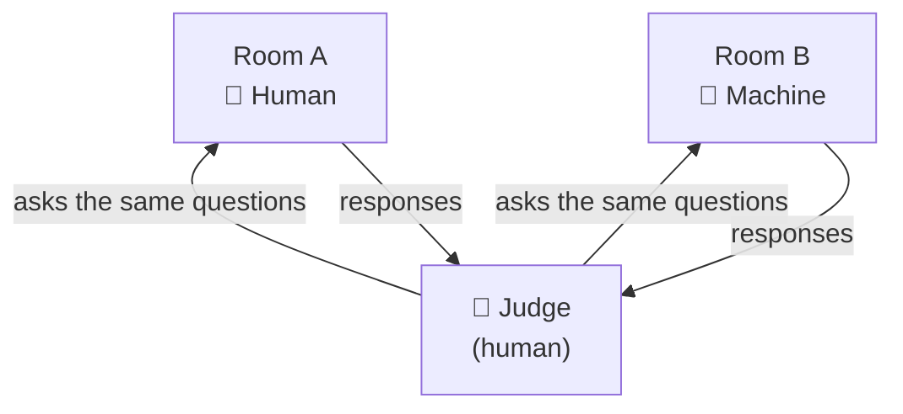
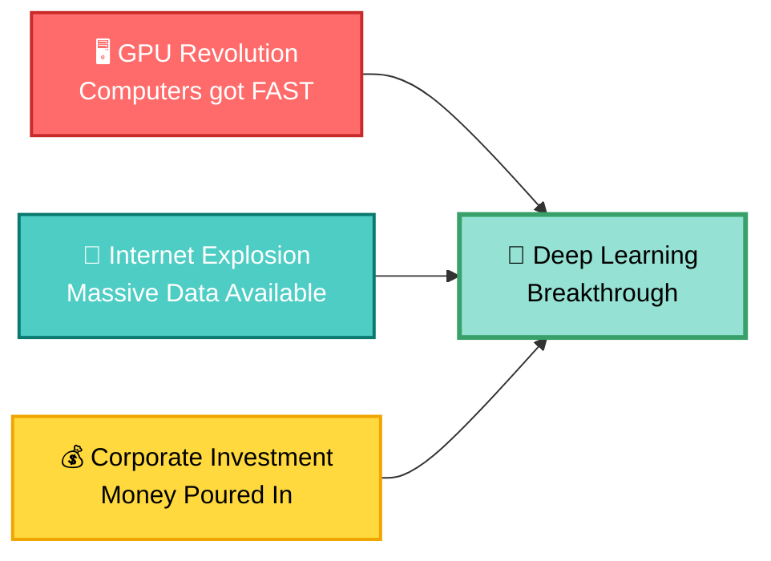

# Episode 02: The Evolution of AI

> **Season 1 — Inside the Mind of AI**

> Where the journey of AI began and how we have evolved so far — a high-level overview of where the AI industry stands today.

---

## What you'll learn

| Foundations | Where AI is going |
|:---|:---|
| 🧩 What Artificial Intelligence means | 🔁 How Transformers changed AI |
| ❄️ Why AI was difficult for decades | ✍️ How LLMs became popular |
| 📚 Why Machine Learning became necessary | 🧭 Why Agentic AI is the next evolution |
| 🧠 Why Deep Learning changed everything | |

---

<details open style="margin-bottom: 1rem;">
<summary><strong style="font-size: 1.25em;">🧩 What is Artificial Intelligence?</strong></summary>

**Definition:** AI is the science of making machines perform tasks that normally require human intelligence.

- A person is considered intelligent if they can **think and make decisions** — if a machine can do that, it's AI
- There is no single "proper" definition of AI — this framing is the practical one to use

### Is it AI? — Examples

| | |
|:---|:---|
| - Playing chess | - Writing poems |
| - Detecting spam in email | - Generating fictional images (e.g. a selfie with a celebrity) |
| - Recommending movies | - Driving a car (self-driving) |

> All of these require some form of intelligence — so yes, all of them are AI.

### Why AI matters right now

- **9 out of the top 10 companies by market cap** are betting heavily on AI: NVIDIA, Apple, Alphabet, Microsoft, Amazon, Meta, Broadcom, Tesla, TSMC (the exception: Saudi Aramco — an oil company)
- New models and tools are released **every day** — coding models, image generation, video, NLP
- Every company and venture capitalist is investing in AI; a lot of research is ongoing
- We are in the middle of a tech **revolution** — the biggest money in the world is flowing into AI

### Why learn the history?

- The AI tools we use today have a very interesting background (~70 years of evolution)
- Understanding where AI came from helps you build a **mental model** of how it evolved
- This episode sets the foundation for everything that follows — worth your full attention

</details>

---

<details style="margin-bottom: 1rem;">
<summary><strong style="font-size: 1.25em;">🕰️ The Early Days: 1950–1955</strong></summary>

> AI is a very new subject in computer science — computer science existed long before it. And AI has survived multiple **hype cycles**: hype rises, hype dies (the "AI winters"), hype rises again. Today we're in a hype phase that doesn't look like it's dying anytime soon.

### 1950 — Can Machines Think?

Before 1950, machines were only used for **computation** — heavy mathematical operations, done fast. Everybody wanted machines to be faster and better, but nobody asked the deeper question:

> **Can machines think?**

This question was asked by mathematician **Alan Turing** in 1950 — and it sparked the field.


> 📷 Alan Turing (1951) — Elliott & Fry, [Public Domain](https://commons.wikimedia.org/wiki/File:Alan_turing_header.jpg), via Wikimedia Commons

#### The Turing Test (Imitation Game)

"Can a machine think?" has no proper definition of *think* — so how do you test it? Turing's answer: the **Turing Test**, based on the **Imitation Game**.

- A **judge** (human) sits in a separate room
- **Room A** contains a human, **Room B** contains a machine — the judge doesn't know which is which
- The judge asks the **same questions** to both and studies the responses
- If the judge **cannot distinguish** the machine from the human → the machine **passes** the test



> If a machine passes the Turing Test, human and machine become **indistinguishable** — that was the 1950 answer to "can machines think?"

### 1955 — The Term "Artificial Intelligence" Is Coined

Computer scientist **John McCarthy** coined the term **Artificial Intelligence** in 1955 — the first time the word was used.


> 📷 John McCarthy (2006) — photo by [null0](https://www.flickr.com/photos/null0/272015955/), [CC BY-SA 2.0](https://creativecommons.org/licenses/by-sa/2.0/), via [Wikimedia Commons](https://commons.wikimedia.org/wiki/File:John_McCarthy_Stanford.jpg)

Researchers came together with an ambitious belief:

> **"Every aspect of learning and intelligence could, in principle, be described precisely enough for a machine to simulate it."**

- A very bold statement — made **70 years ago**, when there was no compute, no GPUs, and no data
- McCarthy could not have imagined that in 2025, AI would be a whole industry and everyone would be using the word he coined

</details>

---

<details style="margin-bottom: 1rem;">
<summary><strong style="font-size: 1.25em;">❄️ Why AI was difficult for decades</strong></summary>

### The Hype Cycle: Rise, Fall, Repeat 🎢

AI didn't evolve smoothly. Instead, it went through **hype cycles** — periods of explosive optimism followed by disappointing crashes. Think of it like a stock market bubble: everyone gets excited, invests heavily, expectations get unrealistic, then reality hits hard.


The 1970s–1980s saw the first major crash:

- **The Problem:** Early AI researchers promised too much — "We'll create thinking machines!" But the computers were too slow, there wasn't enough data, and the algorithms hit a wall
- **The Crash:** When promises weren't kept, investors pulled out. Research slowed. Funding evaporated. Motivation died.
- **The Winter:** This period became known as the **"AI Winter"** — no major breakthroughs, everyone was demotivated, and it felt like AI was a dead field

> The "AI Winter" is what happens when the hype bubble pops and reality doesn't match the promise. It's not about the temperature — it's about the **cold shoulder** the field got.

### 1986 — The Great Naming Debate: "Artificial" vs. "Synthetic"

While the field was struggling, something interesting happened in 1986: a **naming crisis**. Yes, really — scientists were arguing about what to *call* the field.

A computer scientist named **Haugland** raised a philosophical question:

> "Why do we use the word **'Artificial' Intelligence? Doesn't 'artificial' mean *fake*?"

Think about it:
- **Artificial hair** = fake hair
- **Artificial hand** = fake hand
- **Artificial intelligence** = fake intelligence? 🤔

So Haugland coined a new term: **"Synthetic Intelligence"** — the idea that machines can develop *genuine* intelligence *by themselves*, not by mimicking humans.

#### The Two Philosophies

This created a split among researchers:

| **Artificial Intelligence (AI)** | **Synthetic Intelligence (SI)** |
|:---|:---|
| **Goal:** Replicate what humans do | **Goal:** Create genuinely intelligent machines |
| **Approach:** Copy human behavior | **Approach:** Let machines learn independently |
| **How it decides:** Based on training & programming | **How it decides:** Autonomous & self-directed reasoning |
| **Consciousness?** No — just mimicry | **Consciousness?** Possibly — machines might become aware |

> The debate was deep: Are we building **fake intelligent machines** that trick us? Or are we building machines that become **genuinely, authentically intelligent**?

**The winner:** "Artificial Intelligence" stuck around. But Haugland's question still matters today — especially when you talk to ChatGPT and can't tell if it's "real" intelligence or clever mimicry.

### Why This Matters Today

Back then, scientists thought AI would **peak at human level** and stop — that machines couldn't go beyond us. But look at today:

- ChatGPT writes code better than many average developers
- AI generates art, music, and creative content
- AI is **already outperforming humans** in many domains

So Haugland's question from 1986 is now more relevant: **Is today's AI still "artificial" (fake), or is it becoming genuinely intelligent? Does it matter?**

> We don't know yet — and honestly, we might not need to. We just use it and get results. The philosophy is interesting, but the pragmatism is: **does it work?**

</details>

---

<details style="margin-bottom: 1rem;">
<summary><strong style="font-size: 1.25em;">♟️ The Comeback: 1997 — Deep Blue vs. Kasparov</strong></summary>

After years of winter, AI finally had a major breakthrough that captured the world's attention.

### IBM's Deep Blue: The Turning Point

In **1997**, IBM's chess-playing computer **Deep Blue** defeated **Garry Kasparov** in a match — the first time a machine beat a human in direct competition.

This might not sound like much today. But back then? It was **seismic**.

#### Who Was Garry Kasparov?

**Kasparov** wasn't just any chess champion. He was:
- The world's **greatest player at the time** (arguably of all time)
- Not a "casual grandmaster" — he was *the* reference point for human intelligence at chess
- Chess itself was considered **a game of pure intelligence** — if you could play chess at a high level, you were regarded as brilliant

So when a machine defeated the world's greatest human at the world's greatest game of intelligence, the headlines screamed:

> **"Have Machines Become Smarter Than Humans?"**

It was the first time in history a machine had beaten a human in a competition. The world took notice.

#### The Buzz (and the Reality Check) 🤓 vs. 🤖

Deep Blue went **viral**. Media coverage exploded. Everyone was talking about intelligent machines and AI taking over.

But here's the truth that researchers quietly pointed out: **Deep Blue wasn't really "thinking."**

Deep Blue worked by:
- Analyzing **permutations and combinations** of every possible chessboard position
- Using **pure mathematics** to calculate which move would be best
- Playing by brute force — not by understanding chess like Kasparov did

In other words:
- **Kasparov:** Used intuition, experience, creativity, real intelligence
- **Deep Blue:** Used exhaustive calculation — checking every possible move tree

#### The Illusion of Intelligence

Here's the fascinating part: **Deep Blue didn't need to be actually intelligent to *look* intelligent.**

From the outside, when a machine defeated the world's greatest player, everyone assumed it must be thinking. It must be intelligent. It must understand the game.

But inside, it was just running mathematics.

> This raises a question that still matters today: **If something behaves intelligently, does it matter if it's not actually thinking?** Is the illusion of intelligence the same as intelligence itself?

#### Why This Mattered for AI

Deep Blue's victory reignited the field:
- **Funding flooded back** — investors saw proof of concept
- **Researchers returned** — "Look, we CAN build smart machines!"
- **The AI winter was ending** — confidence was restored
- **The narrative changed** — from "AI is dead" to "AI is the future"

> Deep Blue showed the world: "Look, machines CAN be intelligent (or at least *look* intelligent). Give us more time and resources." And the world listened.

</details>

---

<details style="margin-bottom: 1rem;">
<summary><strong style="font-size: 1.25em;">🌟 Standing on the Shoulders of Giants</strong></summary>

Here's something that bothers me: today, everyone talks about **Sam Altman**, **Demis Hassabis**, **Google**, **Anthropic**, and the modern AI boom.

But nobody talks about the people who actually *built* this field.

### The Pioneers Who Started It All

- **Alan Turing** (1950) — Asked the first question: "Can machines think?" Created the Turing Test
- **John McCarthy** (1955) — Coined the term "Artificial Intelligence" itself. Made the bold claim that intelligence could be simulated
- **Others in the 1950s-60s** — Built the foundation that everyone else built on

These were people who had **no data, no GPUs, no compute power, no funding** — and yet they asked the right questions and sparked an entire field.

When you use ChatGPT or code with Copilot today, you're standing on 70+ years of history. You're using tools built by people who stood on the shoulders of Turing and McCarthy.

> **The lesson:** Always know where your field came from. Give credit to the pioneers. Don't just chase the latest hype — understand the history that made it possible.

</details>

---

<details style="margin-bottom: 1rem;">
<summary><strong style="font-size: 1.25em;">📚 Why Machine Learning became necessary</strong></summary>

### The Era of Rule-Based AI (1950s–1980s) 📋

For the first 30 years of AI, there was only one way to make a machine "intelligent": **write rules**.

Intelligence was just a collection of if-else statements. Nothing more.

#### Real-World Examples

**Spam Detection:**
Here's how you'd build a spam filter:
```
if email contains "free" → spam
if email contains "$" → spam
if email contains "lottery" → spam
```

**Medical Diagnosis:**
Here's how you'd build a flu detector:
```
if patient has fever AND cold AND body ache → likely flu
if patient has headache AND nausea → likely something else
```

These were called **Expert Systems** — human experts (doctors, engineers, specialists) would sit down and write hundreds or thousands of rules, and the machine would blindly follow them.

#### The Fatal Flaw 🚨

But there's a problem: **rules can never capture every edge case.**

For your spam detector, what if someone writes:
- "FR€€" (with special characters)
- "F-R-E-E" (with hyphens)
- "free!!!" (with exclamation marks)

How many variations do you write rules for? Hundreds? Thousands? **Infinite?**

> If you try to cover every case with if-else statements, you'll write rules forever and still miss something.

This is why rule-based AI hit a ceiling. It couldn't scale. It wasn't flexible. And when the 1980s AI winter came, people realized: **there has to be a better way.**

### The Machine Learning Revolution 💡

Then someone asked a radical question:

> **"What if we stopped writing rules? What if we showed the machine examples, and let it figure out the rules by itself?"**

This was the birth of **Machine Learning**.

Instead of:
```
Human: "Here are 1,000 rules, follow them"
Machine: "OK, I'll follow your rules"
```

It became:
```
Human: "Here are 1,000,000 examples of spam and not-spam emails"
Machine: "OK, I'll learn the patterns and figure it out myself"
```

#### How Machine Learning Works

For the spam detector:
- You collect **1 million emails** labeled as "spam" or "not spam"
- You show these to the machine
- The machine **learns patterns** — "spam emails tend to have certain words, certain structures, certain characteristics"
- Now when a new email comes in, the machine can say: "Based on what I've learned, this looks 85% like spam"

For distinguishing between cats and dogs:
- You collect **1 million images** labeled "cat" or "dog"
- The machine learns: "Cats tend to have pointy ears, whiskers, and paws"
- "Dogs tend to have floppy ears (sometimes), wet noses, and paws"
- New image comes in → machine recognizes it as cat or dog

#### The Trade-off

Machine learning was a huge step forward, but it still had a limitation: **humans had to tell the machine which features to look for.**

For the cat vs. dog problem, a human would still need to say:
- "Look for eye shape"
- "Look for ear shape"
- "Look for the presence of a trunk or not"
- "Look for whiskers"

The machine didn't discover these features on its own. Humans did.

> Machine Learning = humans write rules → Machine Learning = machines learn patterns from examples (but humans still guide what to look for)

</details>

---

<details style="margin-bottom: 1rem;">
<summary><strong style="font-size: 1.25em;">🧠 Why Deep Learning changed everything</strong></summary>

### The Neural Network Breakthrough 🧠

In the early 2000s, researchers had an inspired idea:

> **"What if we modeled computers after the human brain itself?"**

Human brains have **neurons** that fire and connect to each other. What if we built artificial neurons that could do the same?

This idea led to **Neural Networks** — and eventually **Deep Learning**.

#### The Game-Changer: Automatic Feature Discovery

Here's what made deep learning revolutionary:

**Before (Machine Learning):**
- Human: "Look for eyes, nose, and mouth"
- Machine: "OK, I found eyes, nose, and mouth → that's a face"

**After (Deep Learning):**
- Human: "Here are 1 million face images"
- Machine: "I learned it myself... eyes look like dark circles... nose looks like a triangle... mouths look like curves... and together they're a face"
- **Humans didn't have to tell it anything.**

For the first time, machines could **discover features automatically**. They didn't need human guidance.

#### Real-World Impact 🎯

Deep learning made these breakthrough applications possible:

| Application | Impact |
|:---|:---|
| **Image Recognition** | Google Photos can search "beach" and find all beach photos automatically |
| **Face Unlock** | Your phone recognizes your face without you training it |
| **Speech Recognition** | Alexa, Siri, and Google Assistant understand you |
| **Translation** | Google Translate went from broken to nearly perfect |

Each of these seemed like magic because machines were now **discovering patterns on their own** — not following human-written rules.

#### The Perfect Storm ⛈️

But deep learning wouldn't have been possible without three things aligning at the same time:



**GPU Revolution:** Deep learning requires massive computation. When GPUs (graphics processors) became available and cheap, training neural networks became practical.

**Internet & Data:** The internet exploded with images, videos, and text. Millions and millions of examples became available for machines to learn from. This data was essential.

**Corporate Investment:** Companies like Google, Microsoft, and Meta realized the potential. They invested billions. This attracted researchers, created competition, and accelerated everything.

#### Why Practical Applications Matter 💼

Here's something interesting: deep learning got funded and hyped not just because it was *theoretically* cool, but because it **solved real problems**:

- Face unlock actually worked (and people want it)
- Translation actually improved (and companies wanted it)
- Image recognition actually worked (and marketers could use it)

When practical applications emerged, real money followed. And when money flows into a field, everything accelerates.

This was when the **AI hype cycle started rising again** — and this time, it had real results to back it up.

</details>

---

<details style="margin-bottom: 1rem;">
<summary><strong style="font-size: 1.25em;">🔁 How Transformers revolutionized AI — coming soon</strong></summary>

_(coming soon)_

</details>

---

<details style="margin-bottom: 1rem;">
<summary><strong style="font-size: 1.25em;">✍️ How LLMs became popular — coming soon</strong></summary>

_(coming soon)_

</details>

---

<details style="margin-bottom: 1rem;">
<summary><strong style="font-size: 1.25em;">🧭 Why Agentic AI is the next evolution — coming soon</strong></summary>

_(coming soon)_

</details>

---

## Key Takeaways

- **Rule-based AI (1950s–80s) hit a ceiling** — writing thousands of if-else rules doesn't scale; you can never cover every edge case
- **Machine Learning was the breakthrough** — instead of rules, show machines examples and let them learn patterns (but humans still had to guide what to look for)
- **Deep Learning was the revolution** — neural networks discovered features automatically, without human guidance (image recognition, face unlock, translation)
- **Three things aligned to make deep learning possible:** GPUs (fast compute), the Internet (massive data), and corporate investment (funding)
- **The hype cycle rose again** — when deep learning proved it could solve real problems (face unlock, translation), money and attention flooded back into AI

---

## Resources

- [Full Season 1 Overview](./README.md)
- [External Resources](../resources/useful-links.md)

---

**Status:** Episode 02 in progress

---

| ← Previous | Next → |
|:---:|:---:|
| [Episode 01: Welcome to Namaste AI](./episode-01-welcome-to-namaste-ai.md) | — |
