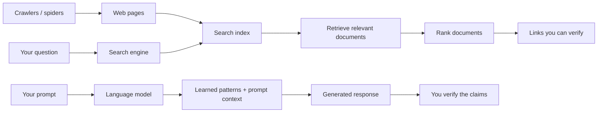
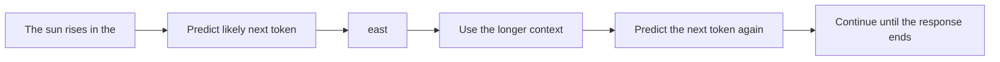
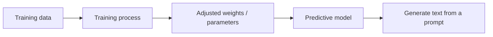
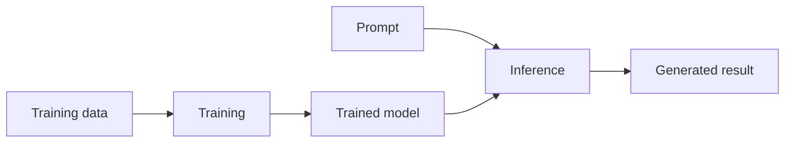
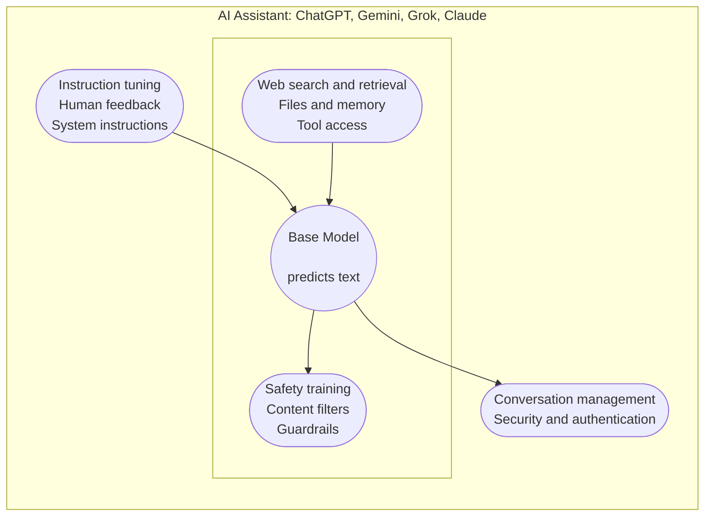
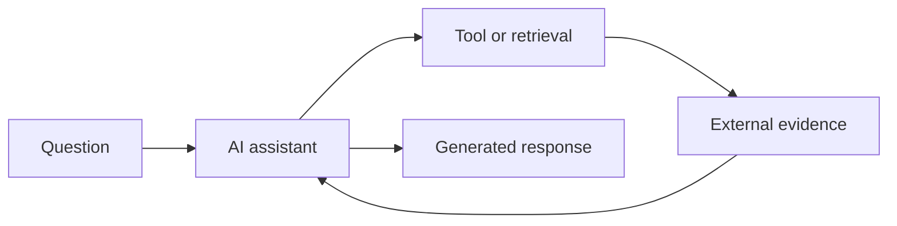

> **Season 1 — Inside the Mind of AI** [🔗](./README.md)

# Episode 03: Does ChatGPT Know or Does It Guess?

> ChatGPT does not retrieve a verified answer from a hidden database by default; it generates a response from learned patterns, context, and any tools the assistant uses.

---

<details id="at-a-glance" style="margin-bottom: 1rem;">
<summary><strong style="font-size: 1.25em;">👀 At a Glance</strong></summary>
<div style="margin-left: 3rem; margin-top: .25rem;">

| Search engines | LLM-based assistants |
|:---|:---|
| Retrieve existing pages from an index | Generate a new response from learned patterns |
| Rank results and show source links | Predict the next token repeatedly |
| Can be checked against the original page | Inference generates a result after training |
| Fresh information may come from newly indexed pages | Tools can retrieve information and extend an assistant |

</div>
</details>

---

<details id="quick-notes" style="margin-bottom: 1rem;">
<summary><strong style="font-size: 1.25em;">📝 Quick Notes — visual revision</strong></summary>
<div style="margin-left: 3rem; margin-top: .25rem; min-height: 1rem;">&nbsp;</div>
</details>

---

<details id="search-vs-llm" open style="margin-bottom: 1rem;">
<summary><strong style="font-size: 1.25em;">🔎 Search Engines vs. LLMs</strong></summary>
<div style="margin-left: 3rem; margin-top: .25rem;">

### How a search engine works

When you search for **"Who is Dr. A. P. J. Abdul Kalam?"**, a search engine generally:

1. Looks through an **index** of discovered web pages.
2. Finds pages that appear relevant to the query.
3. Ranks those pages using many signals.
4. Returns links that you can open and inspect.

📚 The index is like the index of a textbook. It is a fast map to information, not the whole Internet being read from scratch for every question. Crawlers regularly discover and update pages, but coverage and freshness are not guaranteed.

### Crawlers, index, and ranking

🕷️ **Crawlers**, also called spiders, continuously visit accessible web pages. Their job is to help the search engine discover new or changed content and update its index. When a person searches, the engine retrieves matching documents from that index and then ranks them before showing results.

📊 Ranking uses many signals. Examples discussed in this episode include a site's authority, page speed, relevant keywords, backlinks, metadata, and how recent the page is. The exact ranking formula is not public and can change over time.



### How an LLM works at a high level

🧠 An LLM does not normally perform a live search when it receives a prompt. It uses patterns learned during training and the text already present in the conversation to generate a response. The response can be new wording that never appeared as one exact page online.

> **Retrieve** means finding existing information. **Generate** means producing new text. Generation can be useful, but it does not automatically make the result factual.

</div>
</details>

---

<details id="hallucinations" style="margin-bottom: 1rem;">
<summary><strong style="font-size: 1.25em;">⚠️ Why ChatGPT Can Sound Right and Be Wrong</strong></summary>
<div style="margin-left: 3rem; margin-top: .25rem;">

💭 Imagine asking a deliberately mixed, nonsensical question such as **"Why is Namaste AI red wine from the Himalayan region of India so expensive?"** A model may still give plausible reasons for its price even though the question combines details that do not describe a real thing.

🗣️ This behavior is often called a **hallucination**: the model generates a confident-looking claim without a reliable factual basis. It is not necessarily trying to deceive anyone. Its objective is to produce a likely continuation, not to guarantee that every statement is true.

🔍 Search engines also do not guarantee truth. A search result can be outdated, misleading, or poorly ranked. Their advantage is traceability: you can inspect the page, author, date, domain, and other sources.

> **Fluent language is not proof of truth.** Language quality and factual accuracy are separate things.

### A useful verification habit

| Before trusting an answer | What to do |
|:---|:---|
| It contains a fact | Ask for a source and open it yourself |
| It contains a date or current status | Check a current, authoritative source |
| It names a person, product, or study | Confirm that the thing actually exists |
| It includes calculations or code | Recalculate or run the result |
| The answer is unusually confident | Treat confidence as style, not evidence |

</div>
</details>

---

<details id="why-hallucinations-happen" style="margin-bottom: 1rem;">
<summary><strong style="font-size: 1.25em;">🧯 Why Hallucinations Happen</strong></summary>
<div style="margin-left: 3rem; margin-top: .25rem;">

🎲 An LLM predicts likely text. It does not have a built-in truth checker for every claim. Hallucinations become more likely when the model has limited, unclear, or conflicting information and still tries to be helpful.

| Cause | What can happen |
|:---|:---|
| Insufficient information | The model fills a gap with a plausible guess |
| Ambiguous information | It chooses one interpretation without enough evidence |
| Outdated knowledge | It gives an answer that was once true but is no longer current |
| False assumptions | It treats details in a prompt as facts |
| Unreliable patterns | Weak or incorrect patterns can influence the response |
| Optimized to answer | A helpful response can be preferred over saying "I don't know" |
| Probabilistic generation | A likely continuation is not necessarily a verified one |

### Common forms

- **Invented facts** - claims about events, people, or things that are not real.
- **Invented citations** - sources, links, titles, or quotations that cannot be verified.
- **Incorrect combinations** - real details joined together in a false way.
- **Outdated facts** - information that is no longer current.
- **False precision** - an exact number, date, or detail that sounds measured but is guessed.
- **Broken reasoning** - steps that sound logical but do not actually support the conclusion.

</div>
</details>

---

<details id="next-token" style="margin-bottom: 1rem;">
<summary><strong style="font-size: 1.25em;">🧩 The Next-Token Prediction Idea</strong></summary>
<div style="margin-left: 3rem; margin-top: .25rem;">

🔤 **"Predict the next word"** is a useful first mental model. More precisely, language models predict the next **token**. A token can be a whole word, part of a word, punctuation, or another small piece of text.

For example:

```text
The sun rises in the ...
```

🎯 The model assigns scores or probabilities to possible continuations. **"East"** is likely in this context because the model learned strong patterns connecting these pieces of language. It then adds a continuation and predicts the next one using the growing context.



### Why repeated prompts can differ

🔀 For a prompt such as **"Roses are"**, several continuations can fit: *red*, *beautiful*, or *flowers*. The model can select among likely options, so two runs may produce different wording. This is not the same as choosing words with no learned structure; the choices are shaped by the prompt, the model's learned parameters, and generation settings.

✍️ Calling an LLM "autocomplete" is useful for a first explanation, but incomplete. The model has learned complex patterns involving grammar, programming, languages, facts, and associations. It is a very powerful autocomplete, not a simple text-replacement tool.

</div>
</details>

---

<details id="training" style="margin-bottom: 1rem;">
<summary><strong style="font-size: 1.25em;">🧠 Where the Learned Patterns Come From</strong></summary>
<div style="margin-left: 3rem; margin-top: .25rem;">

⚙️ During training, a neural network processes very large collections of data. Its internal numerical parameters, also called **weights**, are adjusted repeatedly so that its predictions improve. After training, those parameters store learned statistical patterns; they are not a searchable copy of every page used for training.



🧷 This is why it is misleading to say that the model simply remembers a web page and fetches it later. It has learned relationships from its training data, but that learning can include errors, gaps, outdated information, and conflicting examples.

</div>
</details>

---

<details id="inference" style="margin-bottom: 1rem;">
<summary><strong style="font-size: 1.25em;">⚡ Inference: Using a Trained Model</strong></summary>
<div style="margin-left: 3rem; margin-top: .25rem;">

🏋️ **Training** is the expensive process of adjusting a model's parameters using large amounts of data. **Inference** happens later, when you give the trained model a prompt and it produces a response.



🪄 Inference is usually much less expensive than training because the model's parameters have already been learned. It still requires compute, especially for large models and long responses, but it does not retrain the model for each prompt.

</div>
</details>

---

<details id="knowledge-cutoff" style="margin-bottom: 1rem;">
<summary><strong style="font-size: 1.25em;">📅 Knowledge Cutoffs and Fresh Information</strong></summary>
<div style="margin-left: 3rem; margin-top: .25rem;">

⏳ Training is expensive and is not continuously repeated for every new web page. A model therefore has a **knowledge cutoff**: a point after which its original training does not include new information.

- It may not know about a recent election, product release, or local event.
- It can state an old answer with confidence if the prompt does not provide newer context.
- An assistant may use web search or another connected source to answer current questions, but that is a separate tool-assisted path.

> A model's stated cutoff date is a property of a particular model or deployment. Do not assume that every model has the same date.

</div>
</details>

---

<details id="confidence" style="margin-bottom: 1rem;">
<summary><strong style="font-size: 1.25em;">🧭 The Confidence Illusion</strong></summary>
<div style="margin-left: 3rem; margin-top: .25rem;">

🗣️ People often use a speaker's tone as evidence. "The answer may be X" feels different from "The answer is definitely X," even when neither statement includes proof. A polished, certain-sounding AI response can create the same effect.

> **Confidence in language is not confidence in truth.** Do not treat a firm tone, clear grammar, or a detailed explanation as evidence by itself.

### Ask for evidence, not just confidence

- Ask the assistant to separate **facts**, **assumptions**, and **uncertainty**.
- Ask for sources, then open and evaluate them yourself.
- Request a web search or retrieval when current information matters.
- Use a calculator, code execution, or another suitable tool for work that must be exact.

🤷 Sometimes an assistant says "I don't know" because of weak evidence, missing tools, system instructions, assistant training, safety rules, or the wording of the prompt. That response is useful, but it is not a guarantee that the assistant would be right in every other case.

</div>
</details>

---

<details id="assistant" style="margin-bottom: 1rem;">
<summary><strong style="font-size: 1.25em;">🤖 Base Model vs. AI Assistant</strong></summary>
<div style="margin-left: 3rem; margin-top: .25rem;">

The key distinction is:

| Base model | AI assistant such as ChatGPT |
|:---|:---|
| Primarily trained to predict the next token | Uses a base model inside a larger product |
| Raw continuation behavior | Instruction tuning helps it follow requests |
| Does not automatically know current information | May have web search or retrieval tools |
| Does not automatically calculate reliably | May call a calculator or code tool |
| Fewer product-level controls | Can include safety controls, system instructions, authentication, and conversation management |

🔧 The exact capabilities depend on the product, model, account, and enabled tools. When ChatGPT searches the web or calculates with a tool, the final answer is not coming only from next-token prediction. The assistant is coordinating the model with external capabilities.

### An AI assistant built around a base model

🏗️ Think of the base model as the central engine: its primary job is predicting text. An AI assistant is the larger product built around that engine. It adds capabilities that help it follow instructions, work with information outside its training, and operate within safety and security controls.



</div>
</details>

---

<details id="tools-and-rag" style="margin-bottom: 1rem;">
<summary><strong style="font-size: 1.25em;">🧰 Tools, Retrieval, and RAG</strong></summary>
<div style="margin-left: 3rem; margin-top: .25rem;">

🌐 Tools extend an AI assistant beyond the base model's learned parameters. Depending on the product and permissions, an assistant can use web search, code execution, calculators, files, calendars, email, databases, location, or weather services.



🔗 Web search can retrieve public information. The LLM can then turn retrieved material into a clear, useful answer. This combination is stronger than retrieval alone because it can summarize and explain, but it still needs verification.

### Retrieval-Augmented Generation (RAG)

📂 **RAG = Retrieval + Generation.** A RAG system retrieves relevant information first, then gives it to the model as context for generating an answer. It is especially useful when an assistant needs to answer from private or internal material, such as company documents, PDFs, or knowledge bases.

> Retrieval adds external context; generation turns it into a useful response. Tools and RAG can reduce some errors, but they do not eliminate them.

</div>
</details>

---

<details id="own-exploration" style="margin-bottom: 1rem;">
<summary><strong style="font-size: 1.25em;">🔬 My Own Exploration: How Does It "Know" Math?</strong></summary>
<div style="margin-left: 3rem; margin-top: .25rem;">

🧮 This part is not from the course — I looked into it myself after wondering how ChatGPT handles a calculation like **738 × 429**. The same correct answer can come from three different processes:

| How the answer appears | What's actually happening |
|:---|:---|
| Memorized | The exact calculation existed somewhere in training data |
| Computed internally | The model reasons through the steps while generating tokens |
| Tool-calculated | The model delegates the arithmetic to a calculator or code tool |

From the outside, all three look identical — just a number. The interesting part: **using a tool is itself a learned behavior.** The model is not consciously deciding "I don't know this"; it generates a tool call when training and system instructions indicate a tool would help, the same way it generates any other token.

> This reframes the episode's question: an LLM does not just answer. Depending on the task, it can generate an answer directly, or generate a request for another tool to get one.

🔗 [Why ChatGPT Can Do Math](https://www.linkedin.com/pulse/why-chatgpt-can-do-math-its-what-you-think-joe-hubert-tuhme/) — external article that prompted this exploration

</div>
</details>

---

<details id="model-self-knowledge" style="margin-bottom: 1rem;">
<summary><strong style="font-size: 1.25em;">🪞 What a Model Knows About Itself</strong></summary>
<div style="margin-left: 3rem; margin-top: .25rem;">

❓ A model can answer questions about its creator, knowledge cutoff, training size, hosting, or capabilities. But its answer is generated from information available in its training, conversation context, system instructions, and tools. It is not direct proof that the model has inspected its own internals or runtime environment.

✅ For practical use, treat claims a model makes about itself like any other claim: verify them against official documentation or the product's settings. A model's apparent self-description should not be confused with self-awareness.

| Possible source of an answer | Example |
|:---|:---|
| Training | General information learned before its cutoff |
| Conversation context | Details you already provided in the chat |
| System instructions | Product-level identity or behavior rules |
| Tools | Current information from connected services |

</div>
</details>

---

<details id="mental-model" style="margin-bottom: 1rem;">
<summary><strong style="font-size: 1.25em;">💡 My Mental Model</strong></summary>
<div style="margin-left: 3rem; margin-top: .25rem;">

📖 I think of a search engine as a librarian who points me to documents, while an LLM is a very capable writer who has learned patterns from a huge reading experience. The writer can explain, combine, translate, and draft ideas quickly, but a convincing explanation is not the same thing as a checked source.

❓ ChatGPT is the writer plus a set of product features and tools. So the first question I should ask is: **Is this response generated from the model's learned patterns, or did the assistant retrieve and verify information with a tool?**

</div>
</details>

---

## Key Takeaways

- **Search engines retrieve and rank existing documents** — LLMs generate text from learned patterns and context. [🔗](#search-vs-llm)
- **Inference uses a trained model to generate a response** — it is different from the earlier, much more expensive training process. [🔗](#inference)
- **Fluent language and confidence do not guarantee truth** — a plausible answer can still be unsupported or wrong. [🔗](#hallucinations)
- **Hallucinations have recognizable causes and forms** — insufficient information, outdated knowledge, false assumptions, invented facts, and false precision are common examples. [🔗](#why-hallucinations-happen)
- **Ask for evidence, uncertainty, sources, or tools when accuracy matters** — confidence alone is not evidence. [🔗](#confidence)
- **Tools and RAG add retrieval to generation** — they add external or private context, but do not remove all errors. [🔗](#tools-and-rag)
- **My own exploration: math can be memorized, computed, or delegated to a tool** — tool use itself is a learned behavior, not a conscious decision. [🔗](#own-exploration)
- **A model's self-description is not proof of self-awareness** — verify product details with official sources. [🔗](#model-self-knowledge)

## Questions / Things to Explore

- How are tokens different from words? [🔗](./episode-04-the-secret-language-of-llms.md#what-is-a-tokenizer)
- How does a model represent meaning numerically? [🔗](./episode-05-how-machines-represent-meaning.md#from-token-ids-to-learned-vectors)
- How does instruction tuning turn a base model into a helpful assistant?
- How do web search and retrieval reduce, but not eliminate, hallucinations?
- How does RAG retrieve the right private documents before generating an answer?

---

| ← Previous | Next → |
|:---:|:---:|
| [Episode 02: The Evolution of AI](./episode-02-the-evolution-of-ai.md) | [Episode 04: The Secret Language of LLMs](./episode-04-the-secret-language-of-llms.md) |