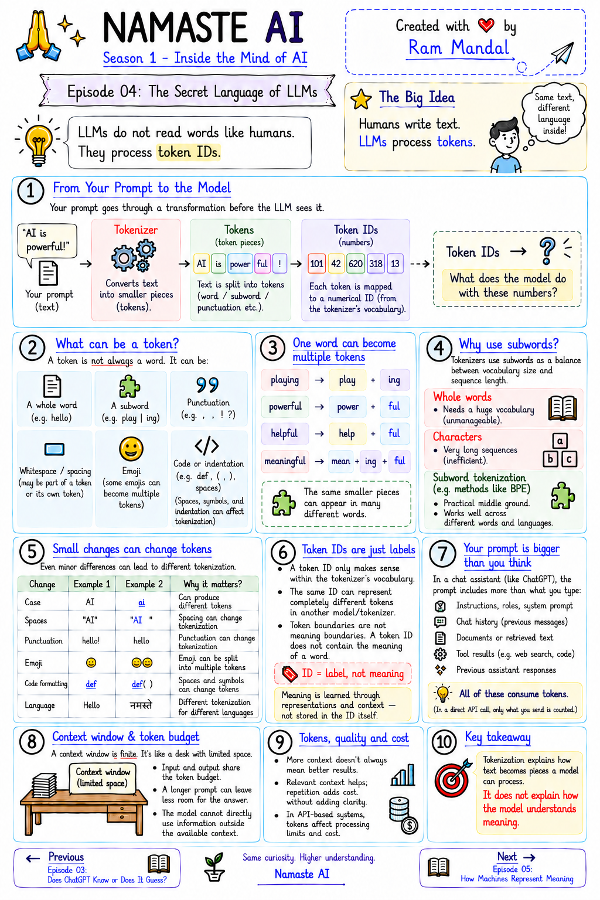
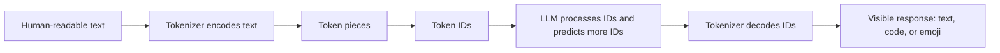

# Episode 04: The Secret Language of LLMs

> **Season 1 — Inside the Mind of AI**

> Before an LLM can continue your prompt, a tokenizer turns your text into reusable pieces and numbers. This episode follows that journey and explains why token count matters.

> **A useful question:** What happens to your prompt before the LLM sees it?

---

## At a Glance

| Question | Short answer |
|:---|:---|
| What does an LLM receive? | A sequence of token IDs, not raw words as humans experience them |
| What is a token? | A piece of text chosen by a tokenizer |
| Is one word always one token? | No. A word may be one token, several subwords, or even smaller pieces |
| Do token IDs have universal meaning? | No. An ID only has meaning inside its tokenizer vocabulary |
| What else uses tokens? | Whitespace, punctuation, emoji, code, roles, tools, documents, and generated output |
| Why should I care? | Tokens affect context limits, processing work, and API cost |

---

<details id="quick-notes" style="margin-bottom: 1rem;">
<summary><strong style="font-size: 1.25em;">📝 Quick Notes — visual revision</strong></summary>
<div style="margin-left: 3rem; margin-top: .25rem;">

</div>
</details>

---

<details id="text-to-token-ids" open style="margin-bottom: 1rem;">
<summary><strong style="font-size: 1.25em;">🔤 From Human Text to Token IDs</strong></summary>
<div style="margin-left: 3rem; margin-top: .25rem;">

### Which language does an LLM understand?

When I read **“Namaste AI is amazing”**, the words immediately trigger meaning. A computer does not receive that human experience directly. It needs a representation that its calculations can work with.

The bridge is **numbers**. Text is first divided into pieces, and each piece is mapped to a number from a particular vocabulary.

For example, if you write:

```text
AI is powerful
```

the tokenizer converts that text into token pieces and maps those pieces to numerical IDs. The exact pieces and IDs depend on the tokenizer being used.

Imagine this simplified example:

```text
Namaste AI is amazing
        ↓
Namaste | AI | is | amazing
        ↓
78      | 12 | 37 | 108
```

The IDs above are invented for explanation. They are not real IDs from a live tokenizer.

### The five-step pipeline



The important vocabulary is:

- **Token** - one piece of text selected by a tokenizer.
- **Token ID** - the number assigned to that piece in a tokenizer's vocabulary.
- **Encoding** - converting text into tokens and token IDs.
- **Decoding** - converting generated token IDs back into visible text.
- **Tokenizer** - the program or algorithm that performs this conversion.

So the more precise version of “the model predicts the next word” is: **the model predicts the next token ID**. Decoding turns the resulting sequence back into something we can read.

### Why the number itself is not meaningful

Suppose one tokenizer uses:

```text
dog -> 12
cat -> 32
cow -> 07
```

Another tokenizer might use completely different numbers for the same strings. The number `12` does not universally mean **dog**. It only points to a piece in the vocabulary that assigned it.

> **Token IDs are like seat numbers in different cricket stadiums.** Seat 10 in one stadium may be behind the bowler, while seat 10 in another stadium may be near the boundary. The number only makes sense together with the stadium's seating plan. A token ID works the same way: it only makes sense inside the tokenizer vocabulary that assigned it.

### 🎮 Try It Yourself: Online Tokenizers

Want to see tokenization in action? These online tools let you paste text and watch it convert to tokens:

- **[OpenAI Tokenizer](https://platform.openai.com/tokenizer)** — See how OpenAI's models tokenize your text. Shows token IDs and counts. Great for experimenting with ChatGPT tokenization.
- **[Tiktokenizer](https://tiktokenizer.vercel.app/)** — A visual tokenizer for OpenAI models. Paste text and see tokens highlighted with their IDs.
- **[Hugging Face Tokenizers](https://huggingface.co/spaces)** — Search for tokenizer demos to experiment with different model tokenizers (BERT, GPT-2, etc.).

Experiment with:
- Different languages (English, Hindi, mixed)
- Punctuation and whitespace variations
- Code and special characters
- Emoji and symbols

This hands-on exploration makes the concept stick better than reading alone.

</div>
</details>

---

<details id="what-is-a-tokenizer" style="margin-bottom: 1rem;">
<summary><strong style="font-size: 1.25em;">🧩 What a Tokenizer Actually Does</strong></summary>
<div style="margin-left: 3rem; margin-top: .25rem;">

A tokenizer is not a tiny machine that understands language. It is code. Given a string, it applies rules and a learned vocabulary to split or encode that string.

There is no single universal tokenizer:

- OpenAI, Meta, Google, and other model builders can use different designs.
- One company can use several tokenizers for different model families.
- Different model versions can use different vocabularies.
- Newer tokenizers may represent some languages or symbols more compactly.

The tokenizer is used on both sides of the model:

| Direction | What happens |
|:---|:---|
| Before processing | A prompt is encoded into tokens and IDs |
| During generation | The model predicts a sequence of next IDs |
| After generation | The IDs are decoded into the response shown to us |

### One word does not mean one token

The first word-by-word picture is useful, but incomplete. A tokenizer may represent a word in many ways:

```text
playing -> play | ing
```

For another simple example, the word `powerful` might be represented as:

```text
powerful -> power | ful
```

This exact split depends on the tokenizer. The useful idea is that `power` and `ful` can be reused in other words, allowing a vocabulary to represent many forms without storing every complete word as a separate entry.

A token can be:

| Possible token | Example or role |
|:---|:---|
| A whole common word | `the` |
| A subword | `play` or `ing` |
| A byte-level piece | A small encoded unit used by some tokenizer designs |
| Whitespace plus a word | A leading space attached to `world` |
| Punctuation | `,` or `?` |
| Part of an emoji | A piece of a multi-code-point emoji |
| Code | A keyword, brace, newline, or indentation |
| A special marker | A role or message boundary used by a model format |

### A tiny formatting change can matter

The exact result depends on the tokenizer, but these changes can alter token boundaries or IDs:

```text
amazing
Amazing

Hello world
Hello  world
```

Case and whitespace are characters too. A leading space may be included in the token for the following word. Adding a second space or a tab changes the input string, so the tokenizer may produce a different sequence.

</div>
</details>

---

<details id="subwords" style="margin-bottom: 1rem;">
<summary><strong style="font-size: 1.25em;">🧱 Why Tokenizers Use Subwords</strong></summary>
<div style="margin-left: 3rem; margin-top: .25rem;">

A tokenizer has to balance two competing pressures:

| Strategy | Advantage | Cost |
|:---|:---|:---|
| Whole words | Short sequences | An enormous vocabulary is needed for every word and variation |
| Characters | A small vocabulary can represent many strings | Every sentence becomes a long sequence of tiny pieces |
| Subwords | Reuses common pieces while keeping sequences manageable | Boundaries may look surprising and are not semantic definitions |

Consider **untrustable**:

```text
untrustable -> un | trust | able
```

The pieces can be reused in many places:

- `un` appears in many prefixed words.
- `trust` is a common word or stem.
- `able` appears in other word forms.

A whole-word vocabulary would need entries such as `trust`, `untrust`, and `untrustable`, plus countless other combinations. A character-only vocabulary would represent `untrustable` as 11 separate characters. Subwords try to find a practical middle ground.

### Token boundaries are not meaning boundaries

If **India** happens to be represented by one token ID, that only tells us the string was found as one reusable vocabulary piece. It does not mean the ID itself contains the idea of a country, a place, or a relationship to **Delhi**.

Tokenization answers:

> “How should this string be represented?”

It does not, by itself, answer:

> “What does this string mean, and what is it related to?”

That second question leads toward embeddings, which the next episode introduces.

</div>
</details>

---

<details id="vocabulary-and-algorithms" style="margin-bottom: 1rem;">
<summary><strong style="font-size: 1.25em;">🧪 Vocabulary, BPE, WordPiece, and Unigram</strong></summary>
<div style="margin-left: 3rem; margin-top: .25rem;">

### Vocabulary and IDs

A tokenizer's **vocabulary** is its collection of usable token pieces together with their ID mapping. A simplified vocabulary might look like this:

```text
un      -> 373
trust   -> 90349
able    -> 562
the     -> 10
ing     -> 15
.       -> 14
```

These mappings are illustrative, not a verified vocabulary table. Vocabulary sizes also differ between tokenizer families. The course mentions examples around 50K and 200K entries, but the exact size and encoding name belong to a specific tokenizer and model.

### Byte-pair encoding: the basic idea

BPE is commonly explained as repeatedly merging frequent neighbouring pieces.

Start with small pieces from examples such as:

```text
low
lower
lowest
```

If `l` followed by `o` appears often, merge it into `lo`. If `lo` followed by `w` is also common, merge it into `low`. Repeat this process and add useful merged pieces to the vocabulary.

```text
l + o -> lo
lo + w -> low
```

The simplified definition is:

> **BPE builds a vocabulary by repeatedly merging frequent neighbouring pieces.**

The name includes **byte** because many BPE systems begin from byte-level representations. The full algorithm has additional details around byte handling, merge order, and vocabulary construction; the short sketch is enough for this episode.

### Bits and bytes in simple terms

Computers store and process information using tiny switches that can be in one of two states:

```text
0 = off
1 = on
```

One such 0-or-1 value is called a **bit**. The word comes from **binary digit**. A bit is the smallest basic piece of digital information.

Several bits can be grouped together to represent more possibilities. A group of **8 bits** is called a **byte**:

```text
1 bit   -> 0 or 1
8 bits  -> 1 byte
```

Because each bit has two possible states, 8 bits can form $2^8 = 256$ different patterns, from `00000000` to `11111111`. A byte can therefore store a small number, or help represent a character such as a letter, punctuation mark, or part of a symbol.

For example, these are different 8-bit patterns:

```text
00000000
00000001
01000001
11111111
```

The pattern is not automatically a letter or a token. A character encoding system decides how a pattern should be interpreted. In the same way, a tokenizer decides how text pieces map to token IDs.

### Why bytes appear in BPE

Byte-level BPE can begin with very small byte representations, then learn useful combinations of neighbouring bytes. If a pattern appears often, the tokenizer can treat a larger combination as one reusable piece.

```text
small pieces -> frequent pair -> larger reusable piece
```

So **bit**, **byte**, and **token** are different ideas:

| Term | Simple meaning |
|:---|:---|
| Bit | One binary value: `0` or `1` |
| Byte | A group of 8 bits |
| Token | A piece of text selected by a tokenizer |
| Token ID | The number assigned to that token in a vocabulary |

An LLM does not receive a token ID because a token is “made of eight bits.” Bits and bytes describe how computers represent data at a low level. Tokens are a higher-level text representation created for language models.

### WordPiece

WordPiece also builds a vocabulary of useful pieces, but it chooses pieces using a different scoring idea from BPE. Instead of merging only the most frequent adjacent pair, it prefers pairs whose combination is especially useful compared with the individual pieces already seen.

In a simplified picture, suppose `play` and `ing` are already useful pieces. The training process may decide that combining them into `playing` is worthwhile when that whole form appears often enough. It keeps adding pieces that improve how well the vocabulary represents the training text.

When encoding, a WordPiece tokenizer often takes the longest piece from its vocabulary that fits the remaining text. Imagine this small vocabulary:

```text
play
playing
##er
##ing
```

It could tokenize the following words like this:

```text
playing  -> playing
player   -> play | ##er
replaying -> [smaller available pieces, depending on the vocabulary]
```

The `##` marker is a common WordPiece convention for a piece that continues a word. It says that `##er` attaches after another piece; it is not a punctuation mark typed by the user. Different tokenizer implementations can use another convention or expose pieces differently.

This is why the same word can be one token when a common full form exists, but several tokens when only its reusable parts exist. Longest-match-first is an encoding rule; the vocabulary itself still has to be learned first.

The safe takeaway is not to treat WordPiece as “BPE with a different name.” They are related subword approaches, but their vocabulary-building procedures are different.

### Unigram

Unigram tokenization takes another route. It begins with a deliberately large set of candidate pieces, then removes pieces that do little to improve the vocabulary. Each retained piece has a score that represents how useful or likely it is.

The lecture presents its vocabulary-building direction as the opposite of BPE:

1. Start with a large set of possible pieces.
2. Estimate which pieces are less useful.
3. Remove weak pieces.
4. Keep a compact set that can still represent the training data.

For example, the candidate vocabulary might initially contain:

```text
untrustable
un
trust
able
untrust
able
```

If `untrustable` is rare, removing it may have little effect because the tokenizer can still represent the word as:

```text
untrustable -> un | trust | able
```

Unlike a simple longest-match rule, Unigram can compare several valid ways to split the same text and choose the sequence with the best total score. With this hypothetical vocabulary:

```text
un | trust | able
untrust | able
```

both splits are possible. The tokenizer chooses the more probable sequence according to its learned scores. A longer piece is not automatically selected just because it is longer.

> Think of Unigram as keeping several sensible ways to pack a word, then choosing the packing with the best learned score.

| Approach | Direction in the simplified picture |
|:---|:---|
| BPE | Start smaller, merge frequent neighbours |
| WordPiece | Build useful pieces with a scoring objective, then often use the longest vocabulary match |
| Unigram | Start larger, remove weak pieces, then choose the most probable segmentation |

These are sketches, not complete implementations. Their shared goal is useful coverage with a vocabulary and sequence length that a model can handle.

</div>
</details>

---

<details id="language-and-formatting" style="margin-bottom: 1rem;">
<summary><strong style="font-size: 1.25em;">🌍 English, Hindi, Hinglish, Emoji, and Code</strong></summary>
<div style="margin-left: 3rem; margin-top: .25rem;">

### Familiar text versus unfamiliar text

Common patterns are more likely to exist as larger reusable pieces. A random or unfamiliar string often matches fewer large pieces and is split more finely.

That is why gibberish can consume more tokens than an English sentence of a similar visible length. In the course demonstration, the English portion was described as using 14 tokens while the gibberish portion used 38. The exact strings are not available in the supplied transcript, so those counts should be treated as the demonstration's values, not a universal rule.

> A lower token count means a more compact string representation. It does not automatically mean deeper understanding.

### English, Hindi, and mixed script

The same rough idea, **“I am learning artificial intelligence,”** can be written in English, Hindi script, or a mixed English/Hindi form. The meaning may be similar, but the visible characters and vocabulary coverage differ.

The course shows these example counts in a newer tokenizer:

| Form | Tokens shown in the demonstration |
|:---|---:|
| English | 6 |
| Hindi | 15 |
| Mixed script | 10 |

Older tokenizer choices produced much larger counts for the Hindi example. Newer vocabulary coverage can make a particular language more compact, but token count alone is not a complete measure of language ability.

### Why Hinglish is interesting

Hinglish can combine:

- English vocabulary;
- Hindi grammar;
- Roman script;
- informal spellings;
- expressions that depend on local context.

A person may understand that `main`, `mai`, and another spelling are intended to mean the same thing. A tokenizer sees different character strings and may assign different pieces and IDs.

So two sentences with the same meaning do not have to share the same token count or token IDs.

### Tokenization fertility

**Tokenization fertility** is a way to describe how many tokens a word, character sequence, or linguistic unit becomes.

- Low fertility: the unit becomes relatively few tokens.
- High fertility: the unit is split into many pieces.

It describes the result of tokenization. It is not a new reasoning step inside the model.

### Emoji are text too

An emoji may look like one symbol to us, but its underlying representation can contain multiple code points. A tokenizer may therefore encode one displayed emoji as one token or several tokens.

The course examples include a heart and fire represented compactly, while some face or sweat-smile examples split into two pieces. The exact row and counts are not preserved in the transcript, so the general lesson is the useful part:

> **One emoji is not necessarily one token.**

### Whitespace and punctuation

Whitespace is not invisible to a tokenizer. These are different strings:

```text
Hello world
Hello  world
Hello\tworld
```

A comma, period, or question mark can also have its own representation. Even inserting a space before punctuation may change the token sequence.

### Code and indentation

Code is text, so tokenizers process its:

- keywords and identifiers;
- braces, brackets, and punctuation;
- newlines;
- spaces and tabs;
- indentation.

Moving a line or changing its indentation changes the string and therefore may change the token IDs. This is one reason generated code usually preserves formatting: newlines and indentation are part of the patterns the model has learned.

</div>
</details>

---

<details id="hidden-structure" style="margin-bottom: 1rem;">
<summary><strong style="font-size: 1.25em;">🧷 The Prompt Contains More Than You Type</strong></summary>
<div style="margin-left: 3rem; margin-top: .25rem;">

Suppose the visible prompt is:

```text
How are you?
```

A public tokenizer may show the tokens for that text. But an assistant request can also include structure around it, such as:

- system instructions;
- user and assistant roles;
- start and end markers for messages;
- tool-output boundaries;
- document or quoted-text markers;
- reserved or special tokens.

A provider may serialize a conversation into a format that is different from the labels shown in the user interface. The exact wire format varies by provider, model, and product. The system/user/assistant sketch is useful for understanding the idea, not for reconstructing a provider's private request exactly.

This hidden structure matters because it also consumes context. A short visible message can be accompanied by a much larger set of instructions, history, retrieved text, or tool results.

</div>
</details>

---

<details id="context-window" style="margin-bottom: 1rem;">
<summary><strong style="font-size: 1.25em;">🪟 Context Windows and Long Conversations</strong></summary>
<div style="margin-left: 3rem; margin-top: .25rem;">

### Why “here” means Dehradun

Imagine a conversation that begins with:

```text
Hello, I am in Dehradun right now.
```

Then the user asks:

```text
Which places can I visit here?
```

The word **here** can refer to Dehradun because the earlier message is present in the active context. The model does not need the word Dehradun repeated in the second message.

The same idea applies when a later request says “sort these places” or asks whether an umbrella is needed after a weather tool has returned information. Earlier messages and tool output give the small word its meaning in that conversation.

### What can occupy context?

A model request may contain:

| Context item | Why it may be present |
|:---|:---|
| System instructions | Product or application behaviour |
| Current user prompt | The immediate task |
| Previous messages | Conversation continuity |
| Uploaded documents | Information supplied by the user |
| Retrieved passages | Relevant external or private information |
| Tool results | Weather, search, calculator, database, or code output |
| Generated text | Earlier assistant responses or the current response as it grows |

A **context window** is the amount of tokenized information a model can process in one request or active generation context. It is a finite working window, not unlimited memory.

### Input and output share the budget

Use a simple example:

```text
Total context: 10,000 tokens
Input:          8,000 tokens
Output space:   2,000 tokens
```

If the input used only 2,000 tokens, then 8,000 tokens would remain in this simplified model. Real products can reserve output space or impose separate limits, but the central idea is the same: input and generated output compete for a finite budget.

### What happens when the window fills?

Applications can handle overflow in different ways:

- reject the request;
- truncate part of the input;
- remove older conversation turns;
- summarize older messages;
- retrieve only relevant sections;
- ask the user to shorten the input;
- split the work across multiple requests.

The exact strategy is product- and model-dependent. A chat interface may still display many old messages from a database even when only a subset, or a summary, is sent to the current model request.

> **Visible chat is not proof of active context.** Seeing an old message on screen does not guarantee that the model is processing it now.

</div>
</details>

---

<details id="prompt-relevance" style="margin-bottom: 1rem;">
<summary><strong style="font-size: 1.25em;">✂️ Long Prompt Does Not Mean Better Prompt</strong></summary>
<div style="margin-left: 3rem; margin-top: .25rem;">

A prompt should be as long as the task needs, not as long as possible.

Compare these requests about JavaScript closures:

### Short and sufficient

```text
Explain closures in JavaScript with one simple example.
```

### Long but repetitive

This version repeats ideas such as “understandable,” “uncomplicated,” “beginner-friendly,” and “easy example.” It uses more tokens but does not add much new direction.

### Long and relevant

```text
Explain closures in JavaScript to a beginner who understands functions
and scope but has never seen lexical environments. Use one example
involving a counter. Keep it under 250 words.
```

The second long prompt adds information that changes the likely response:

| Added detail | What it controls |
|:---|:---|
| `beginner` | The audience |
| `understands functions and scope` | Prior knowledge |
| `never seen lexical environments` | The missing concept |
| `one example involving a counter` | The demonstration |
| `under 250 words` | The output boundary |

The lesson is simple: remove filler and retain information that changes the desired answer.

### Tokens and API cost

In API-based systems, input and output are generally measured in tokens for billing. More input tokens and more generated tokens can mean more cost. There is no price in this episode because prices vary by provider, model, and time.

This makes prompt relevance an engineering concern:

- remove redundant instructions;
- keep constraints that matter;
- include the context needed for a correct answer;
- limit output when a short answer is enough;
- remember that generated tokens count too.

A long prompt is not automatically bad. Extra tokens are worthwhile when they add relevant context, examples, constraints, or definitions.

</div>
</details>

---

<details id="misconceptions" style="margin-bottom: 1rem;">
<summary><strong style="font-size: 1.25em;">🚫 Five Misconceptions to Remove</strong></summary>
<div style="margin-left: 3rem; margin-top: .25rem;">

1. **One token equals one word.** False. A token can be a word, subword, character, whitespace-plus-word, punctuation mark, emoji piece, code piece, or special marker.
2. **One emoji equals one token.** Not necessarily. Some emoji are compact; others split into multiple pieces.
3. **A larger vocabulary is always better.** Not necessarily. A vocabulary should suit the languages, symbols, and code the model needs to represent.
4. **A larger context means perfect memory.** False. It allows more tokenized information, but the window is still finite and the information can still be incomplete or summarized.
5. **More tokens always produce better results.** False. More relevant information can help. Repetition and filler usually add cost without adding clarity.

</div>
</details>

---

<details id="mental-model" style="margin-bottom: 1rem;">
<summary><strong style="font-size: 1.25em;">💡 My Mental Model</strong></summary>
<div style="margin-left: 3rem; margin-top: .25rem;">

I think of a tokenizer as a packing system. It takes a sentence, code file, emoji, or mixed-language message and packs it into reusable pieces that fit the model's vocabulary.

The token IDs are labels on those pieces. The labels help the model handle the input, but the labels are not the meaning. A bag labelled “12” is not automatically the same bag in another warehouse.

The context window feels like a desk with limited space. I can place the current question, earlier notes, a document, tool results, and the answer I am writing on that desk. A larger desk helps, but it still fills up. The best use of space is not “put everything here”; it is “put the information needed for this task here.”

</div>
</details>

---

<details id="practical-connection" style="margin-bottom: 1rem;">
<summary><strong style="font-size: 1.25em;">🛠️ Practical / Engineering Connection</strong></summary>
<div style="margin-left: 3rem; margin-top: .25rem;">

When I build an AI feature, tokenization affects more than a usage counter:

- A document may need chunking before retrieval.
- A long conversation may need summarization or selective history.
- Source code should preserve meaningful indentation and boundaries.
- Multilingual input should be tested instead of assuming equal token efficiency.
- Prompt templates should avoid repeating the same instruction in several ways.
- Output limits should match the actual task.

For a quick experiment, compare the same request after changing only one property:

| Experiment | What to observe |
|:---|:---|
| Lowercase vs. capitalized text | Token boundaries and IDs |
| One space vs. two spaces vs. a tab | Whitespace handling |
| English vs. Hindi vs. Hinglish | Token count and vocabulary coverage |
| Common sentence vs. gibberish | Reusable pieces vs. fragmented pieces |
| One emoji vs. a sequence of emoji | One-token and multi-token cases |
| Code with different indentation | Newline, space, and indentation tokens |
| Older vs. newer tokenizer | Changes in vocabulary coverage |

The goal is not to memorize token IDs. The goal is to notice that small changes in visible text can change the sequence the model receives.

</div>
</details>

---

## Key Takeaways

- [**A tokenizer encodes text into token IDs**](#text-to-token-ids) and decodes generated IDs back into visible text.
- [**Tokens are reusable pieces, not guaranteed words**](#what-is-a-tokenizer); they can include subwords, punctuation, whitespace, emoji pieces, code, and control markers.
- [**Subwords balance vocabulary size and sequence length**](#subwords), while BPE, WordPiece, and Unigram build those vocabularies differently.
- [**Token boundaries are not meaning boundaries**](#subwords); token IDs are local labels, not universal concepts.
- [**Language, spelling, emoji, whitespace, case, punctuation, and code formatting affect tokenization**](#language-and-formatting).
- [**The visible prompt is only part of the request**](#hidden-structure); history, instructions, documents, retrieval, tools, and output also use context.
- [**A context window is finite and shared by input and output**](#context-window), so visible chat history is not necessarily active model context.
- [**Relevant detail is useful; repetition is expensive**](#prompt-relevance), especially when token count affects API cost.
- [**Tokenization explains representation, not meaning**](#mental-model). Embeddings are the next bridge in the course.

## Questions / Things to Explore

- How does an LLM turn arbitrary token IDs into useful representations of meaning?
- How are token embeddings different from the token IDs assigned by a tokenizer?
- Why can two related words receive very different IDs but still become related inside a model?
- How do tokenization choices affect Hindi, Hinglish, and other lower-resource languages in practice?
- How do chat products decide which old messages to keep, summarize, or remove?
- How should a RAG system choose document chunks when token budgets are limited?

---

| ← Previous | Next → |
|:---:|:---:|
| [Episode 03: Does ChatGPT Know or Does It Guess?](./episode-03-does-chatgpt-know-or-does-it-guess.md) | [Episode 05: How Machines Represent Meaning](./episode-05-how-machines-represent-meaning.md) |
