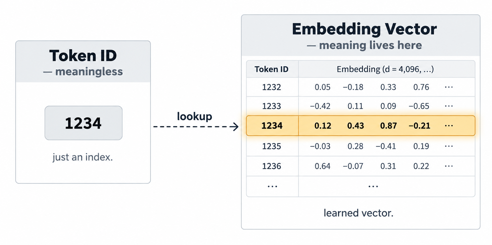
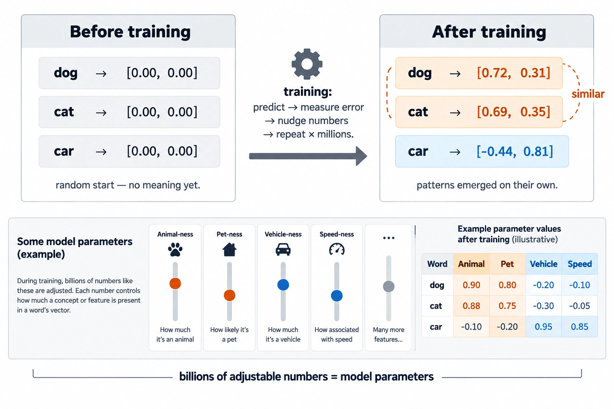
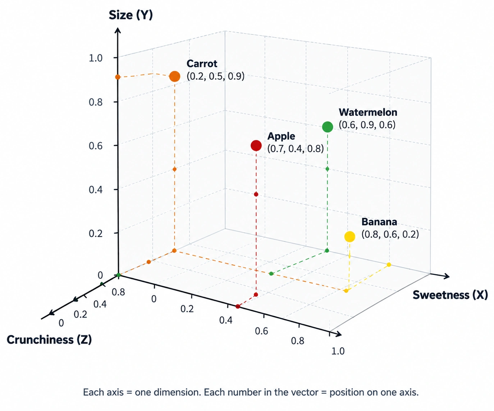
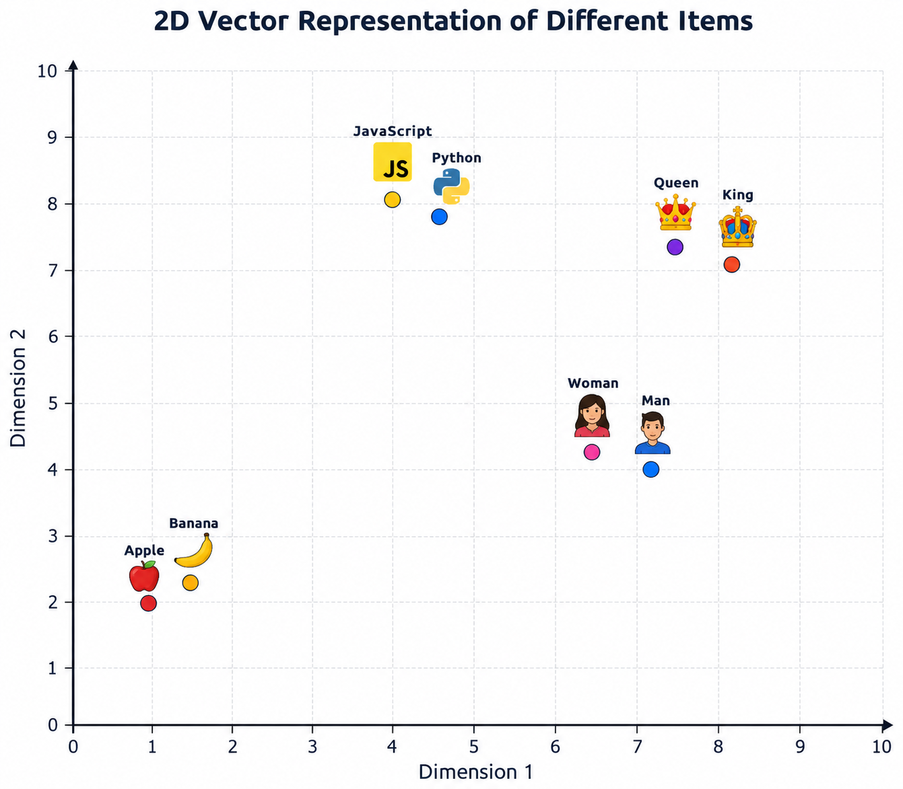
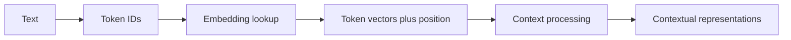

> **Season 1 — Inside the Mind of AI** [🔗](./README.md)

# Episode 05: How Machines Represent Meaning

> Token IDs are meaningless labels. Vectorization and embeddings turn those labels into numerical representations that can capture relationships between words, sentences, images, and other information.

---

<details id="at-a-glance" style="margin-bottom: 1rem;">
<summary><strong style="font-size: 1.25em;">👀 At a Glance</strong></summary>
<div style="margin-left: 3rem; margin-top: .25rem;">

| Question | Short answer |
|:---|:---|
| What is vectorization? | Converting any piece of information (text, image, audio, code) into a numerical vector |
| What is an embedding? | A learned list of numbers that represents an item for a particular model and task |
| Is a token ID an embedding? | No. A token ID is just a vocabulary index — a meaningless number that points to a row in the embedding table. The meaning lives in the learned vector it retrieves, not in the ID itself (like a library card number vs. the book it finds) |
| Does a vector contain a dictionary definition? | No. It captures patterns that training found useful, not a human-readable definition |
| Why does word order matter? | The same tokens can mean different things in a different order, so models also receive position information |
| Are all embeddings the same? | No. Token embeddings help a language model process text; text embeddings help applications compare whole pieces of content |
| Does a high similarity score prove something? | No. It is a model-dependent retrieval signal, not proof of truth, intent, or safety |

</div>
</details>

---

<details id="quick-notes" style="margin-bottom: 1rem;">
<summary><strong style="font-size: 1.25em;">📝 Quick Notes — visual revision</strong></summary>
<div style="margin-left: 3rem; margin-top: .25rem; min-height: 1rem;">&nbsp;</div>
</details>

---

<details id="from-token-ids-to-learned-vectors" open style="margin-bottom: 1rem;">
<summary><strong style="font-size: 1.25em;">🔢 From Token IDs to Learned Vectors</strong></summary>
<div style="margin-left: 3rem; margin-top: .25rem;">

### Why this episode exists

🗣️ Natural language is messy. The same word can mean different things depending on context:

> I ate an **apple** in the afternoon.

> **Apple** launched a new device.

> I am sitting near a river **bank**.

> I have a savings account in **Bank** of America.

Add sarcasm, tone, and cultural context, and the problem gets even harder. Understanding meaning behind words is difficult even for humans. Making a machine do it is a genuinely hard problem in **Natural Language Processing (NLP)**.

This episode answers one question: **How does a machine go from meaningless numbers to useful representations of meaning?**

### A token ID is an index, not meaning

🔢 In the previous episode, text became tokens and then token IDs. A token ID tells the model which entry from a specific tokenizer vocabulary it received. The number itself does not carry meaning.

Try this thought experiment. Imagine a vocabulary table:

```text
dog    -> 8123
mango  -> 612
cat    -> 123
grapes -> 8521
```

Now hide the words and look only at the numbers: `8123`, `612`, `123`, `8521`. Can you tell which number belongs to which word? Can you tell that `dog` and `cat` are related, or that `mango` and `grapes` are both fruits? No. The numbers are arbitrary labels.

> **Token IDs are like student roll numbers or hotel room numbers.** Roll number 20 and roll number 22 do not mean those two students are similar. Room 102 and room 103 are not "closer" in any meaningful sense. The number is just a unique identifier inside one system.

A different tokenizer could assign completely different numbers to the same words. A visible word can also be split into several subword tokens.

### Vectorization: the bridge from labels to meaning

🌉 If token IDs carry no meaning, how does a machine understand anything? The answer is **vectorization**.

> **Vectorization** is the process of converting any piece of information into a numerical vector (an array of numbers).

This is the foundational idea. Computers only understand numbers. They do not read words, see images, or hear audio directly. So before a machine can process anything, that thing must be turned into numbers.

Vectorization is not limited to text. It applies to:

| | |
|:---|:---|
| - Words, sentences, paragraphs, documents | - Images and video frames |
| - Audio and speech | - Code and structured data |
| - Product descriptions | - Any other information a system needs to compare |

When you convert a sentence, an image, or a product listing into an array of numbers, that is vectorization. In a language model, those number arrays are not random — they are **learned** during training. We call these learned number arrays **embeddings**.

### Why numbers?

The reason is simple: **once information is in numerical form, a computer can perform mathematical operations on it.** You can compare two vectors, measure how close they are, add them, scale them, or feed them into a model. Words, images, and audio cannot be "compared" directly by a computer. Numbers can.

That is the entire motivation for vectorization: it turns meaning into a form that mathematics can work with.

### An embedding lookup selects a learned vector

📇 The model has an **embedding table**: one learned vector for each vocabulary entry. The token ID is used as an address to look up its row in that table.

```text
12  -> [ 0.12,  0.43,  0.87, ...]
24  -> [ 0.41,  0.73, -0.12, ...]
182 -> [ 0.12, -0.32,  0.08, ...]
```



These values are invented for explanation. In a real model, each vector commonly has hundreds or thousands of numbers. The values are **model parameters** — the adjustable numbers inside the model that training tunes. No human picks them to "mean" something.

Think of parameters like the knobs on a radio. You do not set each knob by hand to a "correct" frequency. You turn them slightly, listen, adjust again, and again — until the signal comes through clearly. Training does the same thing with billions of numbers: make a prediction, measure how wrong it was, nudge the numbers a tiny bit, repeat millions of times.



Nobody told the model "dogs and cats are similar." The training process adjusted the numbers until its predictions improved, and the useful grouping appeared on its own. Once training is done, those numbers are fixed — they become the model's memory. A 7-billion-parameter model is essentially a file of 7 billion such numbers.

> **Token ID:** “Which vocabulary entry is this?”  
> **Token embedding:** “Which learned starting vector belongs to that entry?”

One important thing to keep in mind: the vector is **not** a dictionary definition stored in number form. It does not say "king = a male ruler of a country." It captures something more subtle — *how this word tends to appear alongside other words*. "King" shows up near "queen," "crown," and "castle." "Banana" shows up near "sweet," "monkey," and "peel." The vector encodes those patterns, not a definition.

</div>
</details>

---

<details id="vectors-dimensions-and-neighborhoods" style="margin-bottom: 1rem;">
<summary><strong style="font-size: 1.25em;">🗺️ Vectors, Dimensions, and Neighborhoods</strong></summary>
<div style="margin-left: 3rem; margin-top: .25rem;">

📍 An embedding is also called a **vector**: an ordered list of numbers. You can picture a small vector as coordinates on a map, although real embedding spaces are far too large to draw directly.

### What is a dimension, really?

Imagine you want to rank fruits on three properties: **sweetness**, **size**, and **crunchiness**. You give each fruit a score from 0 to 1 on each property:

| Fruit | Sweetness | Size | Crunchiness |
|:---|:---:|:---:|:---:|
| Apple | 0.7 | 0.4 | 0.8 |
| Banana | 0.8 | 0.6 | 0.2 |
| Carrot | 0.2 | 0.5 | 0.9 |
| Watermelon | 0.6 | 0.9 | 0.6 |

Now write each fruit as a vector:

```text
Apple      -> [0.7, 0.4, 0.8]
Banana     -> [0.8, 0.6, 0.2]
Carrot     -> [0.2, 0.5, 0.9]
Watermelon -> [0.6, 0.9, 0.6]
```



Each number in the array is one **dimension**. In this toy example, the dimensions have human-readable labels (sweetness, size, crunchiness). If you asked "which fruits are very crunchy?", you would look at the third number and see that carrot (0.9) and apple (0.8) rank highest.

> **A dimension is one axis on which an item is scored.** In the fruit example, you chose the axes. In a real embedding model, the axes are not chosen by anyone.

### The "learned" in learned representation

🌱 The word **learned** is the most important word in the definition of an embedding. No human sits down and decides that dimension 1 means "sweetness" and dimension 2 means "size." The model discovers these axes on its own from data.

Here is how that works in simple terms:

- The model reads millions of sentences, articles, and documents.
- Every time it sees "banana" near "sweet," it nudges banana's vector in a direction that captures that association.
- Every time it sees "king" and "queen" appearing in the same context, it nudges their vectors closer together.
- After enough data, patterns emerge: related items end up with similar vectors, unrelated items end up far apart.

The model is not being told the dimensions. It is **tuning** its numbers up and down based on what it observes, and the useful structure appears on its own.

### A useful analogy: how a baby learns

Think about a newborn baby. The baby does not know what a "king" is. But if every story, every conversation, every picture book pairs "king" with "queen," "castle," and "crown," the baby builds a relationship in its head: these words go together.

A model does the same thing, but at massive scale. It reads millions of documents where "king" and "queen" appear together, where "banana" appears near "sweet" and "monkey," where "sun," "moon," and "planet" cluster in the same sentences. After enough exposure, the numerical relationships form on their own.

> **Linguistic environment** simply means the words that appear near a token in the sentences and documents the model reads. Words that show up in similar situations end up with similar vectors. "King" and "queen" both appear in stories about castles and crowns, so their vectors drift close together. No one programmed that — it emerged from the data.

This is also why the process requires so much compute. No human can assign these values by hand. The model must process enormous amounts of text, adjusting billions of numbers. That is why companies race to build more GPUs and data centers: the "learning" is pure mathematics at a scale that only dedicated hardware can handle.

### Try it: which embeddings are closer?

Look at these three vectors (illustrative values):

```text
King   -> [0.81, 0.32, -0.52, 0.17]
Queen  -> [0.79, 0.36, -0.48, 0.22]
Banana -> [-0.24, 0.91, 0.11, -0.63]
```

Now ignore the names and focus only on the numbers. Which two vectors have the most similar values?

The first two. Their numbers are similar in each position: 0.81 ≈ 0.79, 0.32 ≈ 0.36, −0.52 ≈ −0.48, 0.17 ≈ 0.22. The third vector is very different in every position. That is the signal: **King and Queen are related; Banana is not.**

This is exactly what a **similarity score** measures: how close two vectors are, without needing to know what each dimension "means."

The relationships go beyond obvious pairs. A model that has read enough data will also place:

- **Crown** and **castle** near **king** and **queen** (they appear in the same stories).
- **Monkey** near **banana** (they appear together in descriptions).
- **Sun**, **moon**, and **planet** in a cluster separate from fruits or royalty.

These are not rules someone wrote. They are patterns that emerged from the data.

### Embedding models

🏭 The model that produces these vectors is called an **embedding model**. Each major AI company builds its own:

- OpenAI has its own embedding model.
- Google (Gemini) has its own.
- Anthropic, Meta, and others each build their own.

An embedding model's job is to take information (a token, a sentence, a document) and convert it into a numerical vector. The specific numbers, the number of dimensions, and the relationships captured all depend on which model produced them. A vector from one embedding model is not directly comparable to a vector from another.

### Embeddings as coordinates: a 2D picture

📐 Our brains understand two or three spatial dimensions. We can picture an X-Y graph or an X-Y-Z box. We cannot picture 1,000 dimensions. So to build intuition, I pretend each token has only two numbers and plot them on a flat graph.

```text
King       -> [8.0, 7.0]
Queen      -> [7.5, 7.2]
Man        -> [7.0, 4.0]
Woman      -> [6.5, 4.2]

Apple      -> [1.0, 2.0]
Banana     -> [1.5, 2.3]

JavaScript -> [4.0, 8.0]
Python     -> [4.5, 7.8]
```



Plotted on a 2D graph, you see clusters:

- **King** and **Queen** sit close together.
- **Man** and **Woman** sit close together.
- **Apple** and **Banana** sit close together.
- **JavaScript** and **Python** sit close together.

You can also see directional relationships: the direction from King to Man roughly matches the direction from Queen to Woman. That hints at a gender axis, even though no human labeled it.

> This 2D picture is a **projection** of a much higher-dimensional space. It is useful for building intuition, but it distorts distances and can hide relationships. Treat it as a map sketch, not the territory.

### Why so many dimensions?

Imagine describing every person on Earth using only two attributes: height and weight. That gives you a 2D representation. But a person is not fully captured by two numbers. You would also want age, profession, location, skills, interests, experience, language, and many more.

Language is even more complex than describing a person. The same word can carry multiple meanings, multiple tones, sarcasm, grammatical mistakes, and cultural context. A single word like **Java** can mean a programming language, a coffee, or an island. A phrase like "terribly good" uses a negative word to express a positive meaning.

> **As dimensions increase, the representation becomes richer.** It can capture more characteristics and more complex patterns. But richer also means more storage and more computation.

The fruit example used three dimensions. The King/Queen/Banana example used four. A real embedding model uses **hundreds or thousands** of dimensions:

```text
King -> [1.2, 0.24, -2.3, ..., ...]   (thousands of numbers)
```

Individual coordinates usually do not have a simple label such as "royalty amount" or "fruit score." Meaningful patterns are distributed across the vector working as a whole.

> **More dimensions != more intelligence.** More dimensions can give a representation more capacity to encode complex patterns, but they also increase storage and computation. Every token must be stored as an array of thousands of numbers, and every mathematical operation on those arrays costs power and memory. Whether an embedding is useful depends on its training data, learning objective, model design, and the task used to evaluate it.

### Neighborhoods emerge from usage patterns

When embeddings are trained well, related concepts form **neighborhoods**. These are not manually programmed. They emerge from how words are actually used in the data.

- "The king ruled the kingdom" → **king** and **kingdom** move closer.
- "The queen addressed the nation" → **queen** and **nation** move closer.
- "JavaScript is used in web development" → **JavaScript** and **web development** move closer.
- "Apple and banana are fruits" → **apple**, **banana**, and **fruit** cluster together.

During training, every time the model sees these words together, it makes a tiny adjustment to the relevant dimensions. This is sometimes called **tuning**: the numbers shift slightly up or down, and over millions of examples, useful relationships become encoded in the vector space.

> **Vector space** is the n-dimensional space where all these vectors live. You cannot picture 1,000 dimensions, but mathematically, every token occupies a point in that space, and the distances and angles between points encode relationships.

### Data is the foundation

Everything in an embedding comes from data. The more diverse and large the training data, the richer the patterns the model can capture. This is why companies invest heavily in data collection and curation. The patterns learned from that data shape what the model can represent and what it cannot.

The quality of an embedding is ultimately bounded by the quality and coverage of the data it was trained on.

### An embedding is not the meaning

It is tempting to look at a vector and think, "This array is the meaning of king." It is not. The vector captures **patterns of relationship**: king appears near queen, near crown, near castle. It does not store a picture of a king or a dictionary definition.

A computer does not "understand" what a king is the way you do. It has no image, no story, no feeling. It has numbers, and it performs mathematics on those numbers. The usefulness of the representation comes from the patterns encoded in the numbers, not from any internal comprehension.

</div>
</details>

---

<details id="semantic-similarity-and-cosine-similarity" style="margin-bottom: 1rem;">
<summary><strong style="font-size: 1.25em;">📏 Semantic Similarity and Cosine Similarity</strong></summary>
<div style="margin-left: 3rem; margin-top: .25rem;">

🔍 **Semantic similarity** asks whether two pieces of content express related ideas, even when they do not use the same words.

Compare these queries:

> How do I center a div?

> How can I align an HTML element in the middle of its parent?

The wording differs, so a keyword-only search may miss the connection. A text-embedding system can represent both queries as vectors and compare them. If they are close according to its metric, it can retrieve a useful CSS answer or related documentation.

More examples where keyword matching fails but semantic similarity works:

| Query A | Query B | Why keywords fail |
|:---|:---|:---|
| How can I reset my password? | I forgot my password, how to create a new one? | Only "password" overlaps |
| The application crashes after login. | Software closes immediately when I sign in. | "Crashes" vs. "closes," "login" vs. "sign in" |
| How do I learn Java? | How do I make Java coffee? | "Java" appears in both, but the intent is completely different |

The last example shows the other direction: keyword matching might incorrectly link two unrelated queries because they share a word. Embeddings separate them because the surrounding context points in different directions.

> **Embeddings allow systems to compare broader meaning rather than only matching identical words.** This is the core advantage over keyword-based search.

### Cosine similarity compares direction

📐 One common comparison is **cosine similarity**. It measures the angle $\theta$ between two vectors, so it focuses on whether they point in a similar direction rather than how long the vectors are.

$$
\operatorname{cosine}(a,b) = \frac{a \cdot b}{\lVert a \rVert \lVert b \rVert}
$$

The top part (**dot product**) measures how much the two vectors point in the same direction. The bottom part (**magnitudes**) is just the length of each vector. Dividing by the lengths removes the size difference, so a long vector and a short vector pointing the same way still score near $1$. Think of it as: **ignore how long the arrows are, only compare which way they point.**

Think about the angle:

| Angle $\theta$ | $\cos\theta$ | Interpretation |
|:---:|:---:|:---|
| $0°$ | $1$ | Vectors point in the same direction (most similar) |
| $90°$ | $0$ | Vectors are orthogonal (no directional relationship) |
| $180°$ | $-1$ | Vectors point in opposite directions (most different) |

Two pieces of text can have very different vector lengths (one sentence is short, the other is long) but still point in nearly the same direction. Cosine similarity captures that: **direction matters more than length.**

But do not turn the $-1$ to $1$ scale into a universal meaning meter:

- A score near $1$ does not prove two texts mean exactly the same thing.
- A score near $0$ does not reliably mean “unrelated.”
- A score near $-1$ does not generally mean “opposite meaning.”

The useful threshold depends on the embedding model, how vectors were normalized, the data, and the application. A search system should test its threshold on examples from its real task.

### Similarity is not truth

⚠️ **Embeddings capture relationships. They do not independently verify facts, intent, quality, or safety.**

Two false statements can be semantically similar. Two harmful instructions can be semantically similar. Two texts can be close in topic but disagree completely.

For example:

> JavaScript is the best language.

> JavaScript is the worst language.

These two statements may produce relatively similar embeddings because both express an opinion about JavaScript. The vectors point in a similar direction ("opinion about JavaScript"), even though the claims contradict each other.

Similarity can help find related content. It does not independently verify a fact, infer a user's exact intent, check completeness, or make a result safe. When accuracy matters, inspect the retrieved source and verify the claim.

### 🎮 Try it yourself: TensorFlow Embedding Projector

Want to see embeddings in action? Visit **[projector.tensorflow.org](https://projector.tensorflow.org)** and explore an interactive 3D visualization of 10,000 words in 200 dimensions.

Things to try:

- Search for **sun** → you will see **moon**, **stars**, **galaxy**, **eclipse**, and **clouds** nearby.
- Search for **king** → you will see **queen**, **throne**, **monarch**, **kingdom**, **war**, and **emperor** nearby.
- Search for **JavaScript** → you will see **browser**, **Perl**, **Java**, **algorithm**, **XML**, and **programming** nearby.
- Search for **apple** → you will see both **computer**/**Mac** (the company) and **juice**/**recipe** (the fruit) in the space.
- Search for **bank** → you will see **stock**, **loans**, **ATM** (financial) and **river**, **canal** (geographical) in the space.

> ⚠️ The 3D view is a projection. Do not assume that two words appearing close on screen are truly close in the full 200-dimensional space. Rotate the view and you will see the apparent distances change. The tool is for building intuition, not for measuring exact relationships.

</div>
</details>

---

<details id="order-and-context-change-representation" style="margin-bottom: 1rem;">
<summary><strong style="font-size: 1.25em;">🧩 Order and Context Change Representation</strong></summary>
<div style="margin-left: 3rem; margin-top: .25rem;">

### Identity is not enough; order matters too

🔀 These sentences contain the same words but describe very different events:

```text
Dog bites man
Man bites dog
```

Token embeddings identify which tokens are present. The model also needs **positional information** so it can distinguish where each token appears in the sequence.

> **Token embedding:** Which token is this?  
> **Positional information:** Where is it in this sequence?

Notice that both sentences use the exact same tokens and the exact same token embeddings. The only difference is the **order**. The model therefore needs two things working together:

> **Identity + Order.** The model must know *which* tokens are present *and* *where* each one appears. Without order, "dog bites man" and "man bites dog" would be indistinguishable.

Transformer architectures combine position information with token vectors (the exact method varies by design). Position alone does not understand grammar; it simply gives the model a way to learn patterns in ordered text.

### The same token can mean different things

Now compare these sentences:

> I ate an Apple after lunch.

> Apple released a new device.

The word **Apple** can refer to a fruit or a technology company. The word **bank** has the same challenge: it can mean the side of a river or a financial institution. The word **state** can mean a political region, a physical condition (solid, liquid, gas), or an emotional condition ("I am in a bad state"). The word **bat** can be a cricket bat or a flying mammal. The word **Java** can be a programming language, an island in Indonesia, or a type of coffee. A word with multiple meanings is called **polysemous**. Sarcasm adds another layer: the same words can carry a completely different meaning depending on tone and intent, which is even harder to capture from text alone.

> **Context** means the surrounding words and data that appear along with a token. A word does not exist in isolation; its meaning depends on the sentence around it.

A basic embedding system gives a token one fixed vector, no matter what sentence it appears in. That single vector must somehow represent every meaning of the word, which is not possible. Modern language models solve this using **contextual representations**: the vector for a token changes depending on the words around it.

### How a transformer makes representations contextual

In a transformer-based language model (the architecture behind modern LLMs, introduced in the 2017 paper *"Attention Is All You Need"*):

1. Each token first receives its **initial token embedding** from the embedding table. At this stage, both "bank" tokens (river bank, financial bank) have the **same** starting vector.
2. The model then processes the token together with its surrounding tokens, layer by layer.
3. After multiple layers, the representation becomes **contextualized**: the "bank" in "I sat by the river bank" drifts toward river-related concepts, while the "bank" in "I deposited money in the bank" drifts toward finance-related concepts.

> **The initial token embedding may be the same, but after the model processes the complete sentence, the internal representation changes according to the context.** This process is called **contextualization**.



The exact context a token can use depends on the model's design. For example, most modern LLMs let each token "look at" the tokens before it, while other designs allow a different pattern. The main idea is stable: the final representation of a token depends on more than the token by itself.

</div>
</details>

---

<details id="token-embeddings-text-embeddings-and-limits" style="margin-bottom: 1rem;">
<summary><strong style="font-size: 1.25em;">🧰 Token Embeddings, Text Embeddings, and Limits</strong></summary>
<div style="margin-left: 3rem; margin-top: .25rem;">

🧰 The word **embedding** can refer to several related representations. The question to always ask is: **an embedding of what, and for which task?**

| Representation | What it represents | Common use |
|:---|:---|:---|
| Token ID | One vocabulary entry | Locating a token's learned vector |
| Token embedding | One token before context processing | Starting representation inside a language model |
| Contextual representation | One token after it has been processed with context | Internal language-model processing |
| Text embedding | A sentence, passage, document, or other whole input | Comparing and retrieving larger pieces of content |

### Token embedding vs. text embedding in practice

Take the sentence **"I love JavaScript."**

- **Token embedding:** Each token ("I", "love", "JavaScript") gets its own vector. These vectors help the language model process the sequence internally, one token at a time, in order.
- **Text embedding:** The entire sentence is compressed into **one** vector that represents the whole statement. This is what you use when you want to compare two sentences for similarity.

For example, to check whether "I love JavaScript" and "JavaScript is a very beautiful language" are similar, you need a **text embedding** for each sentence and then compare them with cosine similarity. Token embeddings alone would not give you a single vector to compare.

> **Token embeddings** help an LLM process individual tokens in sequence. **Text embeddings** help applications compare and retrieve larger pieces of content.

### Where text embeddings are used

| | |
|:---|:---|
| - Semantic search | - Clustering |
| - Retrieval (RAG) | - Recommendations |
| - Classification | - Duplicate detection |

**Semantic search.** A documentation search tool embeds a developer's question and every passage in its knowledge base, then retrieves passages with nearby vectors.

**Hybrid search.** In practice, systems often combine keyword search and embedding search. Keyword search is still needed for exact matches: product IDs, error codes, legal clause numbers, specific dates, or place names. Embedding search handles meaning. A **hybrid approach** uses both.

**Recommendation systems.** YouTube, Spotify, and LinkedIn create vectors for content (videos, songs, posts) and for users (based on what they watch, listen to, or engage with). If a user's vector is close to a video's vector, the system recommends that video. A video about the "event loop" can be recommended to someone searching for "microtask queue" because the vectors are close, even though the words differ.

**Clustering.** Embeddings can group similar items together. A YouTube channel can cluster thousands of comments by topic. An email system can group messages by subject (finance, work, personal). A support team can cluster tickets by issue type.

**RAG (Retrieval-Augmented Generation).** A 2,000-page PDF is split into smaller chunks (for example, one page per chunk). Each chunk gets a text embedding. When a user asks "What is thermodynamics?", the system finds the chunk whose vector is closest to the query and feeds that chunk to the LLM as context.

**Classification.** Support tickets can be classified into buckets (billing, technical issue, refund, taxes) by comparing each ticket's embedding to the embeddings of known category examples.

**Duplicate detection.** If two documents, comments, or tickets have very close embeddings, they are likely duplicates or near-duplicates.

**Multimodal embeddings.** Embeddings are not limited to text. Images, audio, video, and documents can all be converted into vectors. A text query "a white cat" and an image of a white cat can produce vectors that point in similar directions, enabling **text-to-image search** and **visual recommendations**.

### Embeddings inherit limits from data and design

Embeddings are learned from human-created data. That data contains cultural patterns, historical inequalities, stereotypes, representation gaps, and social biases. A model's learned representations can reflect those patterns.

For example, if training data consistently associates certain occupations with one gender, the embedding space may encode that association. Companies have a responsibility to evaluate and mitigate these patterns before deploying models.

This is why a good embedding system needs evaluation on representative examples, not just an impressive demo. Check whether it retrieves the right language, domain terms, user groups, and edge cases. Embeddings are powerful comparison tools, but they are not neutral truth machines.

### Common misconceptions

| Misconception | Reality |
|:---|:---|
| An embedding is a dictionary of tokens | It is a numerical representation that captures learned relationships, not definitions |
| Each dimension has one clear human meaning | Meaning is distributed across many dimensions; no single dimension means "sweetness" or "royalty" |
| Similar embeddings mean identical meaning | Similarity can indicate topic, association, opposition, category, membership, or shared context |
| Similarity proves a statement is true | Similarity means relatedness, not truth. Two false statements can be semantically similar |
| One embedding model works equally well for every task | Performance depends on domain, data type, text length, and training objective |
| A 2D or 3D plot perfectly represents the original space | It is a projection that distorts distances; the real space has hundreds or thousands of dimensions |
| More dimensions always means a better model | Larger dimensions create trade-offs in storage, latency, cost, and quality; they do not guarantee better results |

</div>
</details>

---

<details id="mental-model" style="margin-bottom: 1rem;">
<summary><strong style="font-size: 1.25em;">💡 My Mental Model</strong></summary>
<div style="margin-left: 3rem; margin-top: .25rem;">

📚 I think of a token ID as a library call number: it helps the model find one row in its own catalog, but it says nothing useful by itself outside that catalog.

An embedding is like a location on a learned map. Similar items may end up in nearby neighborhoods because of patterns in how they were used. Context is the part that tells the map whether **Apple** means something I eat or the company that makes a device.

The map helps find likely connections. I still need to inspect the actual source before treating a connection as a fact.

</div>
</details>

## Key Takeaways

- **Token IDs are meaningless labels; vectorization turns them into numbers** so that mathematical operations can be performed on them. [🔗](#from-token-ids-to-learned-vectors)
- **Dimensions are learned from data, not defined by humans**; the model discovers which axes capture useful patterns. [🔗](#vectors-dimensions-and-neighborhoods)
- **More dimensions != more intelligence**; they add capacity and cost, but usefulness depends on data, objective, and task. [🔗](#vectors-dimensions-and-neighborhoods)
- **Semantic similarity is task-dependent**; cosine similarity measures vector alignment, not truth or a universal definition of meaning. [🔗](#semantic-similarity-and-cosine-similarity)
- **The model needs both identity and order**; contextualization changes a token's representation through transformer layers based on surrounding words. [🔗](#order-and-context-change-representation)
- **Token and text embeddings serve different jobs**: language-model processing versus comparison of larger content (search, RAG, recommendations — often hybrid with keyword search). [🔗](#token-embeddings-text-embeddings-and-limits)
- **Embedding systems can inherit bias and gaps from data**, so their results need testing and verification. [🔗](#token-embeddings-text-embeddings-and-limits)

## Questions / Things to Explore

- How does a model adjust embedding-table values during training?
- How does an application choose and test a similarity threshold for retrieval?
- How do dedicated embedding models differ from language models used for generation?
- How can a team evaluate retrieval quality across languages, domains, and user groups?

---

| ← Previous | Next → |
|:---:|:---:|
| [Episode 04: The Secret Language of LLMs](./episode-04-the-secret-language-of-llms.md) | [Episode 06: The Computational Brain of Machines](./episode-06-the-computational-brain-of-machines.md) |
