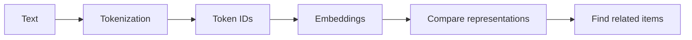

# Episode 05: How Machines Represent Meaning

> **Season 1 — Inside the Mind of AI**

> Embeddings give tokenized text a numerical representation that can capture useful relationships between pieces of information.

---

## At a Glance

| Question | Short answer |
|:---|:---|
| What is an embedding? | A numerical representation of an item, such as a token or text passage |
| Why use embeddings? | Numbers can be compared and processed by mathematical operations |
| Are embeddings the same as token IDs? | No. Token IDs are vocabulary labels; embeddings are learned numerical representations |
| What can be related? | Tokens, words, sentences, documents, images, or other supported data |
| Does closeness prove identical meaning? | No. Similarity is a useful signal, not a complete definition |

---

<details id="quick-notes" style="margin-bottom: 1rem;">
<summary><strong style="font-size: 1.25em;">📝 Quick Notes — visual revision</strong></summary>
<div style="margin-left: 3rem; margin-top: .25rem; min-height: 1rem;">&nbsp;</div>
</details>

---

<details id="from-ids-to-representations" open style="margin-bottom: 1rem;">
<summary><strong style="font-size: 1.25em;">🔢 From Token IDs to Embeddings</strong></summary>
<div style="margin-left: 3rem; margin-top: .25rem;">

### A token ID is only a label

🪪 A tokenizer maps a text piece to a token ID. The ID points to an entry in that tokenizer's vocabulary, but the integer itself does not contain the token's meaning.

For example, a tokenizer might assign:

```text
cat -> 12
kitten -> 45
```

These numbers are only illustrative. Another tokenizer could assign different IDs to the same strings.

### Embeddings add a learned representation

🧠 An embedding is a list of numbers used to represent an item. A model learns useful values for these representations during training, so related items can develop related numerical patterns.

A simplified example might look like this:

```text
cat    -> [0.20, 0.81, 0.14]
kitten -> [0.24, 0.77, 0.18]
car    -> [0.91, 0.12, 0.66]
```

These values are invented for explanation. Real embeddings usually contain many more dimensions, and individual dimensions should not be read as simple human labels.

> **Token ID:** “Which vocabulary entry is this?”  
> **Embedding:** “What learned numerical representation is associated with it?”

</div>
</details>

---

<details id="similarity" style="margin-bottom: 1rem;">
<summary><strong style="font-size: 1.25em;">📏 Similarity Is a Signal</strong></summary>
<div style="margin-left: 3rem; margin-top: .25rem;">

🔗 Once items are represented as numbers, a system can compare those representations. A similarity measure can help identify items that occupy nearby regions in the learned representation space.



A search system can use this signal to find passages related to a query. The result is not a proof that two texts have exactly the same meaning. It is evidence that the system considers their representations related according to the chosen model and comparison method.

⚠️ Similarity can reflect useful relationships, but it can also reflect ambiguity, missing context, or patterns in the data used to learn the representation. Results still need interpretation and, when accuracy matters, verification.

</div>
</details>

---

<details id="context-matters" style="margin-bottom: 1rem;">
<summary><strong style="font-size: 1.25em;">🧩 Context Changes Representation</strong></summary>
<div style="margin-left: 3rem; margin-top: .25rem;">

The same visible word can be used in different contexts. For example, **bank** can refer to a financial institution or the side of a river.

🌊 Context helps a model process how a word is being used in a sentence. This is different from assigning one permanent human-readable meaning to a token ID.

Token embeddings provide an important starting representation. As the model processes surrounding tokens, its internal representations can incorporate more context than the original token alone.

</div>
</details>

---

## My Mental Model

🗺️ I think of a token ID as a library shelf label. It tells the system where an item is stored, but the label itself does not explain the item's relationships.

An embedding is more like a position on a learned map. Items that are useful to compare may appear closer together, although the map is numerical and its dimensions are not simple labels such as “animal” or “vehicle.”

The map is useful for finding patterns. It is not a complete dictionary of meaning.

---

## Key Takeaways

- [**Token IDs are vocabulary labels**](#from-ids-to-representations), not meanings.
- [**Embeddings are learned numerical representations**](#from-ids-to-representations) associated with tokens or larger items.
- [**Numerical representations can be compared**](#similarity) to find related items.
- [**Similarity is evidence, not proof**](#similarity); context and verification still matter.
- [**Context can affect how a word is represented**](#context-matters), especially when the same word has multiple uses.

## Questions / Things to Explore

- How are embedding values learned during model training?
- How can a system compare two embeddings mathematically?
- How do token embeddings differ from sentence or document embeddings?
- How are embeddings used in retrieval systems and vector databases?

---

| ← Previous | Next → |
|:---:|:---:|
| [Episode 04: The Secret Language of LLMs](./episode-04-the-secret-language-of-llms.md) | _coming soon_ |
