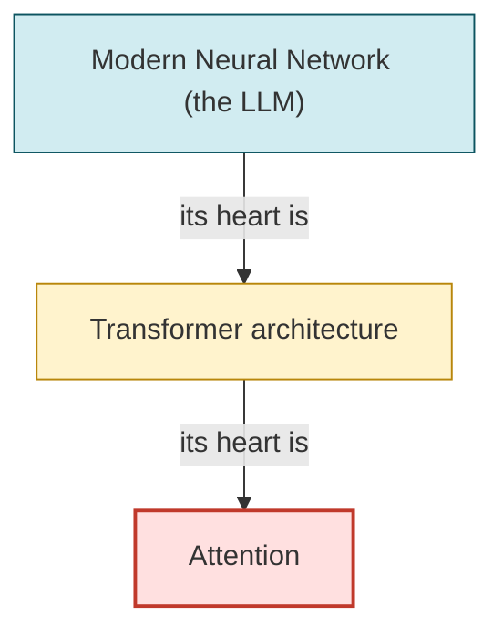
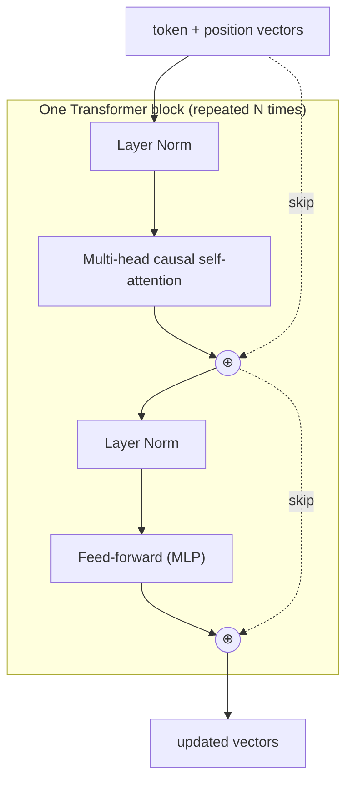
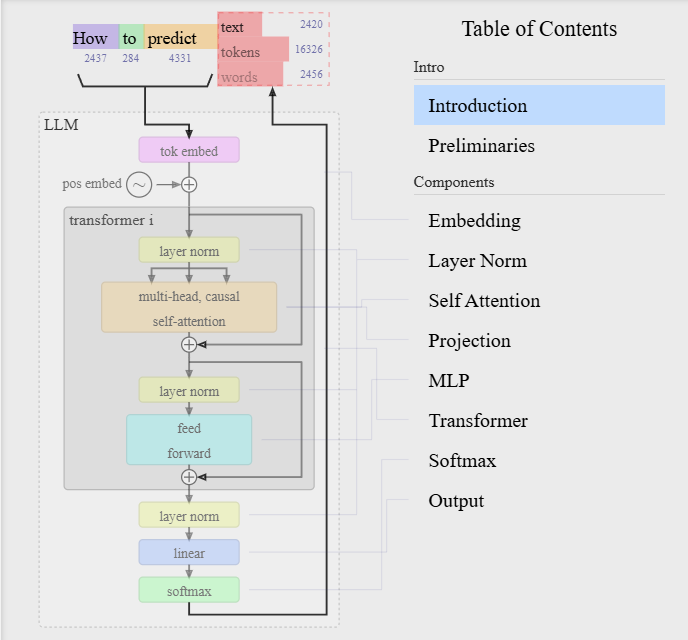

> **Season 1 — Inside the Mind of AI** [🔗](./README.md)

# Episode 06: The Computational Brain of Machines

> An LLM is a prediction machine, and the "brain" that makes the prediction is a neural network built from the Transformer architecture. This episode opens that brain and walks through each part — embeddings, attention, the Transformer block, and the final probability output.

> **A useful question:** What actually happens *inside* the model between the moment your text goes in and the next token comes out?

---

<details id="at-a-glance" style="margin-bottom: 1rem;">
<summary><strong style="font-size: 1.25em;">👀 At a Glance</strong></summary>
<div style="margin-left: 3rem; margin-top: .25rem;">

| Question | Short answer |
|:---|:---|
| What is GPT? | **G**enerative **P**re-trained **T**ransformer — the family of models behind ChatGPT, Gemini, Grok, Claude, and Llama |
| What is a Transformer? | A neural network architecture (2017) that processes a whole sequence at once using **attention** |
| What is attention? | A mechanism that lets each token look at the other tokens and decide which ones matter most |
| What is self-attention? | Attention where tokens attend to *other tokens in the same sequence* — no human tells it what to focus on |
| What is the "heart" of a Transformer? | Attention. Without it, the architecture has no way to relate words to each other |
| What does the model output? | A probability for every token in the vocabulary; the next token is chosen from those probabilities |
| Where can I see the real code? | [nanoGPT](https://github.com/karpathy/nanogpt) and the [GPT-2 codebase](https://github.com/openai/gpt-2/tree/master) — see the [code walkthrough](./episode-06/nanogpt-code-walkthrough.md) |

</div>
</details>

---

<details id="quick-notes" style="margin-bottom: 1rem;">
<summary><strong style="font-size: 1.25em;">📝 Quick Notes — visual revision</strong></summary>
<div style="margin-left: 3rem; margin-top: .25rem; min-height: 1rem;">&nbsp;</div>
</details>

---

<details id="what-is-gpt" open style="margin-bottom: 1rem;">
<summary><strong style="font-size: 1.25em;">🧠 What Is GPT, Really?</strong></summary>
<div style="margin-left: 3rem; margin-top: .25rem;">

### Recap: an LLM is a prediction machine

🔁 In the previous episodes we established that an LLM is a **prediction machine**. Give it a half-finished sentence and it predicts the **next token** (not the next "word" — technically it is a token). It then feeds that token back in and predicts the one after it, and so on. That loop is how every response you see in ChatGPT, Gemini, or Grok is built, one token at a time.

```text
"The pizza is"        -> predicts "ready"
"The pizza is ready"  -> predicts "to"
"The pizza is ready to" -> predicts "eat"
...
```

The *how* of that prediction is the subject of this episode. The machine that does the predicting is a **neural network**, and the specific design of that neural network is what we call a **Transformer**.

### GPT = Generative Pre-trained Transformer

🧩 The full form of **GPT** is **Generative Pre-trained Transformer**. Each of the three words carries meaning:

| Word | What it means |
|:---|:---|
| **Generative** | It *generates* new output by predicting the next token. It does not retrieve a stored answer the way a search engine does. |
| **Pre-trained** | It has *already* been trained on a huge amount of data before you ever talk to it. When you use ChatGPT, the heavy learning is done. |
| **Transformer** | The *architecture* — the specific neural network design that runs behind modern LLMs. This is the hero of the story. |

> ⚠️ **GPT is not just ChatGPT.** OpenAI popularized the name with "ChatGPT," so people often use "GPT" to mean OpenAI's product. But *every* modern LLM — Gemini, Grok, Claude, Llama — is a GPT in the technical sense: a Generative Pre-trained Transformer. The name is a general architecture, not a brand.

### Why "Transformer" matters

⏪ Before 2017, sequence models like **RNNs** and **LSTMs** (Long Short-Term Memory) processed text one token at a time, in order. That made it hard for them to connect words that were far apart in a sentence. The Transformer changed the game: it processes the **whole sequence at once** and uses **attention** to let every token relate to every other token it is allowed to see.

> **The Transformer is a type of neural network architecture designed to process sequences of information using attention.**

That single sentence is the whole idea. The rest of this episode unpacks it.

</div>
</details>

---

<details id="attention-is-all-you-need" style="margin-bottom: 1rem;">
<summary><strong style="font-size: 1.25em;">📄 "Attention Is All You Need" (2017)</strong></summary>
<div style="margin-left: 3rem; margin-top: .25rem;">

📄 The Transformer was introduced in a 2017 research paper titled **"Attention Is All You Need"** by a team of researchers from Google (Google Brain and Google DeepMind) and the University of Toronto. The paper is short on the number of new moving parts and enormous in its impact: essentially every LLM you use today is built on the architecture it describes.

You can read the original paper here:

- 📄 [Attention Is All You Need (Vaswani et al., 2017) — NeurIPS 2017](https://proceedings.neurips.cc/paper_files/paper/2017/file/3f5ee243547dee91fbd053c1c4a845aa-Paper.pdf)
- 📄 [arXiv version](https://arxiv.org/abs/1706.03762)

> ⚠️ **Do not read the paper cold.** If you open it without the background from this episode, the math will go over your head. Read this episode first, then the paper becomes a reference you can actually follow. The paper's core contributions, in plain terms:
>
> 1. **Drop the recurrence.** Instead of processing tokens one-by-one (RNN style), process the entire sequence in parallel.
> 2. **Attention is the whole game.** The model's ability to relate tokens to each other comes entirely from the attention mechanism — hence the title.
> 3. **Stack identical blocks.** The model is just many copies of the same block (attention + feed-forward) stacked on top of each other. More blocks = more capacity.

The paper's title is a hint about what matters most: **attention**. That is the heart of the architecture, and the next section explains why.

</div>
</details>

---

<details id="attention-and-self-attention" style="margin-bottom: 1rem;">
<summary><strong style="font-size: 1.25em;">❤️ Attention and Self-Attention</strong></summary>
<div style="margin-left: 3rem; margin-top: .25rem;">

### The problem attention solves

Consider this sentence:

> The cat sat on the mat because **it** was tired.

What does **it** refer to? The cat, or the mat? Now change one word:

> The cat sat on the mat because **it** was cozy.

Now **it** almost certainly refers to the **mat** (a cozy mat, not a cozy cat). The meaning of **it** depends entirely on the words around it. Older sequential models struggled with exactly this kind of reference, especially when the related words were far apart.

**Attention** is the mechanism that lets the model figure out which other words a given word should focus on, and *how much* to focus on each one.

### Self-attention: tokens talking to each other

👀 **Self-attention** is attention where each token looks at the *other tokens in the same sequence* and computes a relationship score with each of them. No human tells the model what **it** refers to — it works that out on its own from the numbers.

Think of it as each token asking: *"How relevant is every other word to me?"* The answer is a set of weights (numbers that add up to 1). A higher weight means "pay more attention to that word."

For the word **it** in "The cat sat on the mat because it was tired," the model might assign rough relationship scores like:

| Token | Relationship score to "it" | Reading |
|:---|:---:|:---|
| cat | 0.9 | Strongly related — "it" probably means the cat |
| mat | 0.4 | Somewhat related |
| sat | 0.2 | Weakly related |
| because | 0.1 | Barely related |

The high score for **cat** is the model's way of saying *"it" refers to the cat.* Change the sentence so the mat is the natural referent, and the scores shift.

> **Self-attention = attention between the tokens of the same sequence.** Each token can look at the other tokens in the same sentence and learn the relationships between them.

### A second example: the word "bank"

Self-attention is what disambiguates words with multiple meanings:

> I went to the **bank** to deposit money.

> I sat on the **bank** of the river.

The token **bank** is the same in both sentences, but the surrounding tokens are different. In the first, **bank** sits near *deposit* and *money*, so attention pulls its meaning toward the financial sense. In the second, it sits near *sat* and *river*, so attention pulls it toward the riverside sense.

> **The same token can mean different things. Self-attention lets the model read the surrounding words and pick the right meaning.**

### How it is computed (the intuition, not the math)

Under the hood, self-attention turns each token's vector into three things — a **Query**, a **Key**, and a **Value** — and then:

1. Each token's **Query** is compared against every other token's **Key** to produce a relevance score.
2. The scores are normalized (with a step called **softmax**) into weights that add up to 1.
3. Each token's new representation becomes a **weighted average** of all the **Values**, using those weights.

So a token's updated vector is a blend of the whole sentence, weighted by what it decided to pay attention to. That is the entire mechanism in one breath. (The [code walkthrough](./episode-06/nanogpt-code-walkthrough.md) shows the actual lines that do this.)

> 🔒 **Causal** (or "masked") attention: in a language model that predicts the *next* token, a token is only allowed to attend to tokens **at or before** its position — never to future tokens. Otherwise the model could "cheat" by peeking at the answer. This is why the diagram says *multi-head, **causal** self-attention.*

</div>
</details>

---

<details id="the-heart-of-the-transformer" style="margin-bottom: 1rem;">
<summary><strong style="font-size: 1.25em;">🫀 The Heart of the Transformer</strong></summary>
<div style="margin-left: 3rem; margin-top: .25rem;">

🫀 There is a nesting of "hearts" worth memorizing:

> **The heart of a modern neural network is the Transformer architecture. The heart of the Transformer architecture is attention.**

Without attention, the Transformer has no way to relate words to each other, and without the Transformer, modern LLMs do not exist. Attention is the beating center of the whole thing.

The course uses a vivid analogy to make this stick: just as, in the image of Lord Hanuman, Lord Ram is said to reside in his heart, **attention resides in the heart of the Transformer.** The point is not religious — it is a memory hook for the idea that attention is the innermost, most essential part.



> 🖼️ **Image slot:** If you'd like a richer visual of this "heart within a heart" idea (for example, a stylized diagram of a Transformer with a glowing attention core), generate one and drop it here. Suggested prompt: *"A clean, minimal diagram of a neural network with a transformer block inside it, and a glowing heart-shaped core labeled 'Attention' at the center, soft colors, educational style."*

</div>
</details>

---

<details id="inside-the-neural-network" style="margin-bottom: 1rem;">
<summary><strong style="font-size: 1.25em;">🔬 Inside the Neural Network: The Full Pipeline</strong></summary>
<div style="margin-left: 3rem; margin-top: .25rem;">

🔬 Now let's open the "brain" and follow a single forward pass, matching the boxes in the [architecture diagram](#how-to-visualize).

### Step 1 — Tokens become vectors (embeddings)

The model does not understand text; it understands numbers. Each token ID is looked up in an **embedding table** to get a vector (a list of numbers). This was covered in depth in [Episode 05](./episode-05-how-machines-represent-meaning.md).

```text
"pizza" (token 4331) -> [0.12, -0.43, 0.87, ...]   (hundreds/thousands of numbers)
```

### Step 2 — Add position information

A bag of vectors loses word order, and order matters ("dog bites man" ≠ "man bites dog"). So a **position embedding** — a vector that encodes *where* the token sits in the sequence — is added to each token's vector. Now the model knows both *what* each token is and *where* it is.

### Step 3 — Pass through the Transformer blocks

The combined vectors enter a stack of identical **Transformer blocks**. Each block does two things, in order:

1. **Multi-head causal self-attention** — the tokens talk to each other (see the [attention section](#attention-and-self-attention)). "Multi-head" means this happens several times in parallel, each "head" free to learn a different kind of relationship (grammar, reference, topic, etc.).
2. **Feed-forward network (MLP)** — a small neural network applied to each token *independently*, letting the model do non-linear processing of what it just learned.

Two important details make these blocks stable and powerful:

- **Layer Norm** — before each part, the vectors are normalized (their values are rescaled to a consistent range). This keeps the numbers well-behaved as they flow through many layers.
- **Residual (skip) connections** — the input to each part is *added back* to its output (the `⊕` symbols in the diagram). This lets information flow straight through the network and makes training deep stacks possible.



> 📐 **How many blocks?** A small GPT-2 has **12** blocks; larger models have dozens or more. Each block refines the representation a little further. The numbers `n_layer`, `n_head`, and `n_embd` in the [code walkthrough](./episode-06/nanogpt-code-walkthrough.md) control exactly this.

### Step 4 — Turn the final vector into probabilities

After the last block, one more **Layer Norm** is applied. Then a **linear** layer projects each token's vector out to a number for *every* token in the vocabulary (tens of thousands of numbers). Finally, **softmax** converts those raw numbers into a probability distribution that adds up to 1.

```text
"The pizza is" -> softmax -> { ready: 0.75, hot: 0.68, delicious: 0.40, ... potato: 0.01, ... }
```

### Step 5 — Pick the next token and repeat

The model samples the next token from that probability distribution (it does not always take the single highest one — sampling adds variety). The chosen token is appended, and the **entire** sequence runs through the pipeline again to predict the token after that. A full stop is just another token, so the model can "decide" to end the sentence the same way it decides anything else.

> 🧠 **The whole response is this loop, repeated:** embed → attend → feed-forward → probabilities → pick a token → repeat. It looks magical, but it is the same small set of operations running over and over.

</div>
</details>

---

<details id="how-to-visualize" style="margin-bottom: 1rem;">
<summary><strong style="font-size: 1.25em;">🎨 How to Visualize This (the Easy Way)</strong></summary>
<div style="margin-left: 3rem; margin-top: .25rem;">

🎨 The diagram below is the standard way to picture a GPT model. Here is a beginner-friendly way to read it without getting lost in the boxes.



### How to read the diagram (top to bottom)

1. **Tokens in** — the words `How to predict text tokens words` arrive with their token IDs (2437, 284, 4331, …).
2. **tok embed + pos embed** — each token becomes a vector, and a position vector is added so the model knows the order.
3. **transformer i** — the core block, repeated many times. Inside it: *layer norm → multi-head causal self-attention → layer norm → feed forward*, with two "skip" (residual) connections around each part.
4. **layer norm → linear → softmax** — the final vector is turned into a probability for every token in the vocabulary.
5. **Output** — the chosen token is appended, and the whole sequence runs through again to predict the next one.

### Think of it as a factory assembly line

Imagine a factory that turns raw words into a prediction. The line has a fixed set of stations, and every token travels down the same line:

| Station | What happens | Plain-language job |
|:---|:---|:---|
| 1. **tok embed** | Token ID → vector | "Translate the word into numbers" |
| 2. **pos embed** | Add a position vector | "Stamp where in the sentence it sits" |
| 3. **self-attention** | Tokens compare with each other | "Let every word check which other words matter" |
| 4. **feed forward** | Small network per token | "Do some private thinking on the result" |
| 5. **layer norm** (×3) | Rescale the numbers | "Keep the numbers from blowing up" |
| 6. **linear + softmax** | Vector → probabilities | "Turn the thinking into a ranked guess list" |

Stations 3 and 4 are wrapped together as **one Transformer block**, and that whole block is repeated many times (the diagram shows "transformer i" — the *i*-th of many).

### The two "⊕" symbols are the secret to depth

The little circles with a plus sign are **residual connections**. They mean: *"add the original input back to the output."* Picture it as the assembly line keeping a copy of the original part and merging it with the improved version at each station. This is what lets you stack dozens of blocks without the signal getting lost.

> 🧭 **If you remember one thing:** the model is just *embed → (attention + feed-forward) × N → probabilities*. Everything else is detail around that skeleton.

### See it move

The diagram is a still frame. To watch the data actually flow through a real model, try the interactive visualizations:

- 🌐 **[bbycroft.net/llm](https://bbycroft.net/llm)** — an interactive 3D visualization of a GPT model. You can watch tokens move through the embedding, attention, and feed-forward layers in real time. (This is the source of the diagram above.)
- 📺 **[Andrej Karpathy — "Let's build GPT from scratch"](https://www.youtube.com/watch?v=kCc8FmEb1nY)** — builds a tiny GPT in code, which pairs perfectly with the [code walkthrough](./episode-06/nanogpt-code-walkthrough.md).

</div>
</details>

---

<details id="read-the-code" style="margin-bottom: 1rem;">
<summary><strong style="font-size: 1.25em;">🛠️ Read the Real Code</strong></summary>
<div style="margin-left: 3rem; margin-top: .25rem;">

🛠️ The best way to make the internals concrete is to read a small, readable implementation. Two are worth your time:

| Repo | Why it is useful |
|:---|:---|
| [**nanoGPT** — karpathy/nanogpt](https://github.com/karpathy/nanogpt) | A clean, minimal GPT in PyTorch. The whole model lives in one file, `model.py`, with comments. Ideal for learning. |
| [**GPT-2** — openai/gpt-2](https://github.com/openai/gpt-2/tree/master) | OpenAI's original reference implementation. Bigger and more production-oriented, but the canonical source. |

> 📖 **Start with nanoGPT's `model.py`.** It is short enough to read in one sitting, and every box in the diagram above has a matching class in the file.

I have written a line-by-line walkthrough of the important parts of `model.py` (the embedding, the attention, the Transformer block, and the final output) so you can map the code directly onto the diagram:

👉 **[Episode 06 — nanoGPT Code Walkthrough](./episode-06/nanogpt-code-walkthrough.md)**

</div>
</details>

---

<details id="mental-model" style="margin-bottom: 1rem;">
<summary><strong style="font-size: 1.25em;">💡 My Mental Model</strong></summary>
<div style="margin-left: 3rem; margin-top: .25rem;">

🏛️ I picture the model as a room full of people (the tokens), each holding a note (its vector). At each round, everyone reads everyone else's note and decides who to pay attention to, then rewrites their own note as a blend of what they heard. They do a bit of private thinking after that, and the whole round repeats many times. At the end, each person raises a hand for every possible next word, and the heights of the hands are the probabilities.

The "heart" idea helps me remember the priority: the attention step is where the actual *understanding of relationships* happens. The feed-forward step is just processing. So if I ever feel lost in the architecture, I go back to attention — that is the beating center.

</div>
</details>

## Key Takeaways

- **GPT = Generative Pre-trained Transformer** — a general architecture, not just OpenAI's product; every modern LLM is one. [🔗](#what-is-gpt)
- **The Transformer (2017, "Attention Is All You Need")** processes a whole sequence at once instead of one token at a time. [🔗](#attention-is-all-you-need)
- **Self-attention lets each token relate to the others**, which is how the model resolves references like "it" and ambiguous words like "bank." [🔗](#attention-and-self-attention)
- **Attention is the heart of the Transformer**, and the Transformer is the heart of the modern neural network. [🔗](#the-heart-of-the-transformer)
- **The pipeline is embed → (attention + feed-forward) × N → probabilities**, with layer norm and residual connections keeping it stable. [🔗](#inside-the-neural-network)
- **The output is a probability over the whole vocabulary**; the next token is sampled from it, then the loop repeats. [🔗](#inside-the-neural-network)
- **Reading nanoGPT's `model.py` makes it concrete** — every diagram box has a matching class. [🔗](#read-the-code)

## Questions / Things to Explore

- What exactly does each "head" in multi-head attention specialize in?
- How do the number of layers, heads, and embedding size trade off against cost and quality?
- Why does sampling (temperature, top-k) change the style of the output?
- How does the model learn to stop (emit an end-of-sequence token) at the right time?

---

| ← Previous | Next → |
|:---:|:---:|
| [Episode 05: How Machines Represent Meaning](./episode-05-how-machines-represent-meaning.md) | _coming soon_ |
