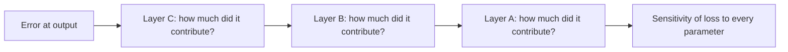
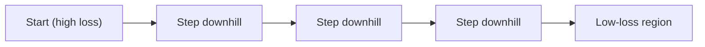
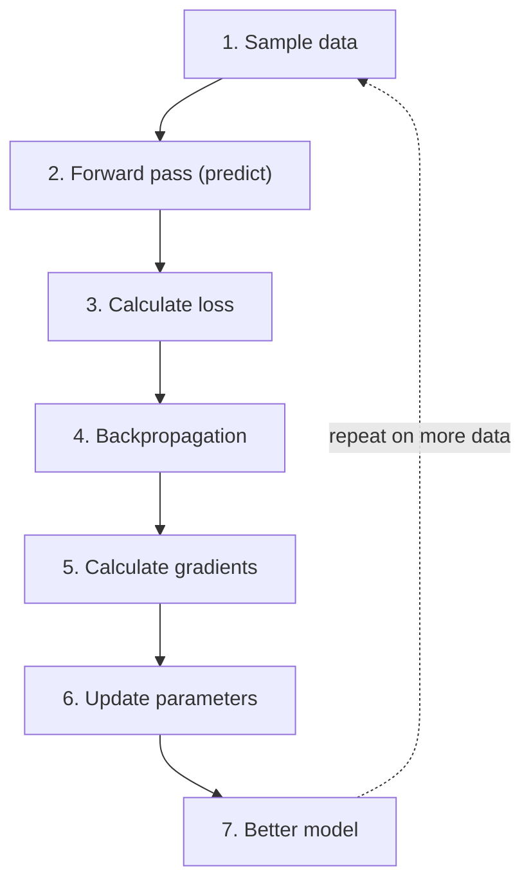

> **Season 1 — Inside the Mind of AI** [🔗](./README.md)

# Episode 07: Sharpening the Brain

> In the last episode we opened the brain and saw how a *trained* model predicts the next token. This episode asks the deeper question: how does an untrained brain become a good one? The answer is **training** — and training is just the repeated, careful adjustment of a huge collection of numbers called **parameters**.

> **A useful question:** If a neural network is "just numbers," what does it actually mean for a machine to *learn*?

---

<details id="at-a-glance" style="margin-bottom: 1rem;">
<summary><strong style="font-size: 1.25em;">👀 At a Glance</strong></summary>
<div style="margin-left: 3rem; margin-top: .25rem;">

| Question | Short answer |
|:---|:---|
| What does "learning" mean for a machine? | Adjusting **parameters** so future predictions get better |
| What are parameters? | A huge collection of adjustable numbers (weights and biases) inside the network |
| How big are they? | GPT-3 had **175 billion**; newer models are estimated in the trillions |
| Do parameters store knowledge? | Not as memory — they are stateless numbers with **patterns** learned from data |
| How do we measure a bad prediction? | A **loss function** turns prediction quality into a single number |
| How do we know which numbers to change? | **Backpropagation** works backward from the error to find each parameter's effect |
| How do we actually change them? | **Gradient descent** nudges each parameter against its gradient, sized by the **learning rate** |
| What is the whole loop? | Sample → forward pass → loss → backprop → gradients → update → repeat |

</div>
</details>

---

<details id="quick-notes" style="margin-bottom: 1rem;">
<summary><strong style="font-size: 1.25em;">📝 Quick Notes — visual revision</strong></summary>
<div style="margin-left: 3rem; margin-top: .25rem; min-height: 1rem;">&nbsp;</div>
</details>

---

<details id="what-learning-means" open style="margin-bottom: 1rem;">
<summary><strong style="font-size: 1.25em;">🧠 What Does "Learning" Actually Mean?</strong></summary>
<div style="margin-left: 3rem; margin-top: .25rem;">

### Trained vs. untrained

🔁 In [Episode 06](./episode-06-the-computational-brain-of-machines.md) we *assumed* the neural network was already trained — that is why "the pizza is" confidently predicted "ready." This episode flips that assumption. We start with an **untrained** network and ask how it becomes good.

An untrained network has no idea what comes next. Feed it "the sky is" and it might say **potato**, **banana**, **cool**, or **magic** — anything at all. A well-trained network, by contrast, leans hard toward **blue**. The difference between those two behaviors is exactly what training produces.

> **Untrained → random, meaningless output. Trained → meaningful, likely output.** Training is the process that moves a model from the first to the second.

### The one-sentence definition

🧠 Here is the whole idea in plain English. Read it slowly:

> **A neural network contains a huge amount of adjustable numbers, called parameters. During training, we repeatedly modify those parameters so that the model becomes better at a particular objective.**

For a language model, that objective is simple: **predict the next token better.** So "learning" is not some mysterious process — it is the act of **adjusting parameters** until future predictions improve.

### The knob analogy

🎛️ Picture a giant mixing console with **millions and billions of knobs**. Each knob is one parameter. Turn one knob a little and the output gets slightly better or slightly worse. Training is the slow, precise act of turning *all* of those knobs — some up, some down — until the sound (the output) comes out clean.

It is a lot like tuning an old radio: you rotate the dial until you land on the exact frequency where the channel is clear. A neural network has an almost incomprehensible number of such dials, and training finds the setting where the "signal" (the correct next token) comes through.

> 🧭 **If you remember one thing from this section:** *learning = adjusting parameters.* Everything else in this episode is about **how** we decide which parameters to move, and by how much.

</div>
</details>

---

<details id="parameters" style="margin-bottom: 1rem;">
<summary><strong style="font-size: 1.25em;">🔢 Parameters: The Adjustable Numbers</strong></summary>
<div style="margin-left: 3rem; margin-top: .25rem;">

### What parameters are

🔢 **Parameters are the learned numerical values that determine the model's behavior.** They are not text, not rules, not a database — they are just numbers. When input flows through the network, it is combined with these numbers through a lot of arithmetic (dot products, matrix multiplications), and the result is the output.

Patterns and knowledge learned during training are **encoded across** these parameters. That is why the same network, with different parameter values, behaves completely differently.

### How big is "huge"?

📏 The scale is hard to feel, so here are some anchors:

| Model | Parameters | Note |
|:---|:---:|:---|
| **GPT-3** | **175 billion** | Publicly announced by OpenAI |
| **GPT-4 / GPT-5** | Not officially disclosed | Researchers estimate **hundreds of billions to trillions** |

> ⚠️ **Needs verification:** Exact parameter counts for GPT-4 and later models are **not officially published**. Figures like "1.8 trillion" circulate online but are estimates, not confirmed numbers. Treat them as "very large," not as fact.

### Where do parameters live? (mapping back to Episode 06)

🗺️ You already met most of these in the [architecture walkthrough](./episode-06-the-computational-brain-of-machines.md). Every one of these boxes is full of parameters:

| Part of the network | Parameters it holds |
|:---|:---|
| **Embedding table** | A vector for every token in the vocabulary |
| **Self-attention** | The **Q, K, V** weight matrices and the **output (O)** projection |
| **Layer Norm** | The **scale (γ)** and **shift (β)** values |
| **Feed-forward (MLP)** | The **projection weights** and **biases** |

> 🧩 **The punchline:** an LLM, at its core, *is* a very large collection of numbers. "The model" you download is essentially this set of adjusted parameters. When a company says "a 70-billion-parameter model," it is counting exactly these numbers.

</div>
</details>

---

<details id="do-parameters-store-knowledge" style="margin-bottom: 1rem;">
<summary><strong style="font-size: 1.25em;">🧩 Do Parameters Store Knowledge?</strong></summary>
<div style="margin-left: 3rem; margin-top: .25rem;">

🧩 This is a favorite interview question, and the precise answer matters:

> **Parameters do not store knowledge the way a database or a memory does.** They are **stateless numbers** — a list of values with no built-in meaning. But they contain **patterns** that were learned from training data, and those patterns let the model produce knowledgeable-looking output when you feed it input.

Think of them as **knowledge enablers**, not a knowledge store. The model does not "remember" a fact it can look up; it has shaped its numbers so that, given the right input, the arithmetic lands on a sensible answer.

### A clean way to answer it

If asked *"do parameters store knowledge?"*, a strong answer is:

> "They don't have memory or store facts directly. They are just numbers, but those numbers have patterns learned from training data. When input is combined with them, the math produces the right output."

> ⚠️ **Watch the wording.** Saying "the model *knows* X" is loose. Saying "the model's parameters are tuned so it *predicts* X well" is more accurate — and it keeps you honest about the difference between *knowing* and *predicting* (a theme from [Episode 03](./episode-03-does-chatgpt-know-or-does-it-guess.md)).

</div>
</details>

---

<details id="training-data" style="margin-bottom: 1rem;">
<summary><strong style="font-size: 1.25em;">📚 Training Data: Where the Patterns Come From</strong></summary>
<div style="margin-left: 3rem; margin-top: .25rem;">

📚 **Training data is the data you feed into the model to make it smart.** It is *separate* from the parameters — parameters live *inside* the network; training data is what you *pass in*.

To build a large language model, you gather an enormous amount of public text — web pages, articles, books, code, and more — and convert it into **tokens**. Those tokens are fed through the network, and the network's parameters are adjusted to match what actually comes next in the text.

```text
Training data (text)  ->  tokens  ->  fed into the network  ->  parameters get adjusted
```

> 🧭 **Keep the two things straight:** *training data* = the input you give it. *parameters* = the internal numbers that change as a result. Confusing them is the most common mistake at this stage.

</div>
</details>

---

<details id="forward-pass" style="margin-bottom: 1rem;">
<summary><strong style="font-size: 1.25em;">➡️ The Forward Pass</strong></summary>
<div style="margin-left: 3rem; margin-top: .25rem;">

➡️ The **forward pass** is the same pipeline you saw in [Episode 06](./episode-06-the-computational-brain-of-machines.md): input goes in, flows through the Transformer blocks, and a probability for every token comes out. The architecture does not change during training — what changes is the *values* of the parameters inside it.

With an **untrained** network, the initial parameters are essentially **random numbers**, so the forward pass produces a nonsense distribution. For "the sky is," it might look like:

| Candidate next token | Untrained probability |
|:---|:---:|
| banana | 0.85 |
| green | 0.61 |
| blue | 0.20 |
| beautiful | 0.55 |
| best | 0.15 |

Notice that **banana** is winning, even though "the sky is banana" makes no sense. That is the signature of an untrained model: the numbers have not been shaped yet.

> 🧭 **The forward pass is the "make a prediction" step.** Training is built around it: predict, check how wrong you were, then adjust.

</div>
</details>

---

<details id="loss-function" style="margin-bottom: 1rem;">
<summary><strong style="font-size: 1.25em;">📉 The Loss Function: Measuring How Wrong We Are</strong></summary>
<div style="margin-left: 3rem; margin-top: .25rem;">

📉 To improve, the model first needs a number that says *how bad* its prediction was. That number is the **loss**.

> **A loss function is a numerical way to measure how bad the prediction is.** It converts the quality of a prediction into a single number.

Because we have the training data, we already know the *correct* next token. The loss function compares the model's prediction against that correct answer:

- **Correct prediction → small loss** (near zero if it nailed it)
- **Very wrong prediction → large loss**

### A concrete example

Suppose the correct answer is **blue**. Compare two predictions:

| | Prediction A | Prediction B |
|:---|:---:|:---:|
| blue | 90% | 2% |
| banana | low | 80% |
| **Loss** | **Low** ✅ | **High** ❌ |

In **Prediction A**, the model put most of its confidence on the right token, so the loss is small. In **Prediction B**, it put 80% on *banana* and only 2% on *blue*, so the loss is large — a clear signal that the parameters need adjusting.

> 🧭 **The loss is the model's report card.** Big loss = "you were wrong, fix the parameters." Small loss = "you were close, keep going."

</div>
</details>

---

<details id="backpropagation" style="margin-bottom: 1rem;">
<summary><strong style="font-size: 1.25em;">⬅️ Backpropagation: Finding the Culprits</strong></summary>
<div style="margin-left: 3rem; margin-top: .25rem;">

⬅️ Now the hard question. There may be **billions** of parameters. When the prediction is wrong:

- **Which** parameters were responsible for the mistake?
- **How** should each one change?

We cannot just nudge all of them blindly. **Backpropagation** (short for *backward propagation of the error*) is the technique that answers both.

### The idea

🔙 Backpropagation starts from the **error at the output** and works **backward** through the network, layer by layer. It asks, in sequence:

- How much did the last layer contribute to the error?
- How much did each weight in that layer contribute?
- What about the layer before it? And its weights?
- …all the way back to the first layer.

The result is the **sensitivity of the loss to each parameter** — a number that says "if you nudge *this* parameter, the loss changes by *this* amount."



> ⚠️ **Common misconception:** backpropagation does **not** update the weights. It only *calculates* how each parameter affects the loss. The actual updating is done by a separate step (gradient descent, next section).

</div>
</details>

---

<details id="gradient" style="margin-bottom: 1rem;">
<summary><strong style="font-size: 1.25em;">📐 The Gradient: Which Way to Move</strong></summary>
<div style="margin-left: 3rem; margin-top: .25rem;">

📐 The numbers backpropagation produces are called **gradients**. A **gradient** tells you two things about a parameter:

1. **How sensitive** the loss is to that parameter (the size).
2. **Which direction** moving it will change the loss (the sign).

### A tiny example

Imagine a particular weight is currently **0.40**. Its gradient says: *"increasing this weight will increase the loss."* So to reduce the loss, we should nudge this weight slightly **downward**. Another weight's gradient might say the opposite — that one should move **upward**.

> 🧭 **The rule of thumb:** move each parameter in the direction that *lowers* the loss. The gradient tells you which way that is.

### The important distinction

| Step | What it does |
|:---|:---|
| **Backpropagation** | Calculates the **gradients** (how each parameter affects the loss) |
| **Optimization algorithm** | Uses those gradients to **actually update** the parameters |

Backprop gives the *information*; the optimizer takes the *action*. Keeping these two separate is the key to not getting confused.

</div>
</details>

---

<details id="gradient-descent" style="margin-bottom: 1rem;">
<summary><strong style="font-size: 1.25em;">⛰️ Gradient Descent: Taking the Steps</strong></summary>
<div style="margin-left: 3rem; margin-top: .25rem;">

⛰️ **Gradient descent** is the iterative optimization algorithm that actually moves the parameters. Its job is to **minimize the loss** by adjusting parameters in the **opposite direction of their gradients**.

### The mountain analogy

🥾 Imagine you are standing on a foggy mountain and want to reach the lowest point (the minimum loss). You cannot see the whole mountain, but you can feel the slope under your feet. The **gradient** points in the direction of **steepest increase** — uphill. So to get *down*, you step in the **opposite** direction.

Take a small step, feel the new slope, take another step, repeat. Eventually you settle into a low-loss region. That is gradient descent.



### The three core concepts

| Concept | Role |
|:---|:---|
| **Loss function** | Defines what "bad" means (the thing we minimize) |
| **Gradient** | Points the direction of steepest increase |
| **Learning rate** | Sets **how big a step** we take each update |

### The learning rate

🎚️ The **learning rate** controls the step size. It is one of the most important settings in training:

- **Too large** → you overshoot the minimum and the loss bounces around or even explodes.
- **Too small** → you crawl; training takes forever to make progress.
- **Just right** → steady, reliable descent toward a low loss.

### Main variants

How much data you use per step gives three common flavors:

| Type | Data used per update | Trade-off |
|:---|:---|:---|
| **Batch Gradient Descent** | The *entire* dataset | Accurate direction, but very slow per step |
| **Stochastic Gradient Descent (SGD)** | *One* sample at a time | Fast, noisy updates |
| **Mini-batch Gradient Descent** | A *small batch* of samples | The practical middle ground — most training uses this |

> 🧭 **In practice**, large models are trained with **mini-batch** gradient descent, often with a smarter optimizer (like Adam) that adapts the effective step size per parameter.

</div>
</details>

---

<details id="training-loop" style="margin-bottom: 1rem;">
<summary><strong style="font-size: 1.25em;">🔁 The Training Loop</strong></summary>
<div style="margin-left: 3rem; margin-top: .25rem;">

🔁 Put all the pieces together and training is a loop that runs over and over, on a huge amount of data:



Each cycle makes the parameters a *little* better. Run it across **enormous** amounts of data and the small improvements compound into a model that predicts the next token well.

> 🧭 **The loop is the whole story:** *predict → measure the error → find the gradients → nudge the parameters → repeat.* Everything in this episode is one part of that loop.

</div>
</details>

---

<details id="self-supervised" style="margin-bottom: 1rem;">
<summary><strong style="font-size: 1.25em;">🪞 Self-Supervised Learning</strong></summary>
<div style="margin-left: 3rem; margin-top: .25rem;">

🪞 A striking thing about this training setup: **we do not need a human to label the data.** The model learns from the data *itself*.

The trick is that the **next token becomes the target**. Given a piece of text, the model predicts what comes next, and the *actual* next token in the training data is the correct answer — for free.

```text
"The sky is ___"   ->  model predicts the next token
                     ->  the real next token in the data is the target
```

Because every stretch of text gives you a prediction task automatically, you can train on *all* the text in the world without anyone writing a single label. This is called **self-supervised learning**, and it is a big reason modern LLMs can be trained on such massive data.

> 🧭 **Why it matters:** the "supervision" (the correct answer) is built into the data itself, so the amount of usable training signal is essentially unlimited.

</div>
</details>

---

<details id="key-idea" style="margin-bottom: 1rem;">
<summary><strong style="font-size: 1.25em;">🌱 The Key Idea: Learning Is Repeated Optimization</strong></summary>
<div style="margin-left: 3rem; margin-top: .25rem;">

🌱 The single most important takeaway: **a neural network does not learn a concept from one weight update.** Useful behavior does not appear in a single step.

It **emerges through repeated optimization.** Again and again:

> **Predict → calculate loss → backpropagate → calculate gradients → update parameters**

Each pass moves the parameters a little. After enough passes over enough data, the parameters settle into values that encode the patterns of the training data — and the model starts making genuinely good predictions.

> 🧭 **One line to carry forward:** *training is not a single event, it is a loop run billions of times until the numbers are shaped just right.*

</div>
</details>

---

<details id="mental-model" style="margin-bottom: 1rem;">
<summary><strong style="font-size: 1.25em;">💡 My Mental Model</strong></summary>
<div style="margin-left: 3rem; margin-top: .25rem;">

🎛️ I picture training like tuning a giant instrument. The model starts as a wall of knobs set to random positions, so it plays pure noise ("the sky is banana"). Each training step is: play a note, listen to how off it sounds (the loss), figure out which knobs are off (backprop), and turn each one a hair (gradient descent). No single turn fixes the song — but after billions of tiny turns, the noise resolves into music.

The part that keeps clicking for me is how *un-magical* it is. There is no memory, no stored facts, no rulebook. Just numbers, a way to measure how wrong they are, and a way to nudge them the right way — repeated until the patterns show up. Once you see it that way, "the model learned" just means "the numbers got tuned."

</div>
</details>

---

## Key Takeaways

- **Learning = adjusting parameters** so the model's next-token predictions get better. [🔗](#what-learning-means)
- **Parameters are just numbers** (weights and biases) living in the embeddings, attention, layer norm, and feed-forward layers. [🔗](#parameters)
- **Parameters don't store knowledge** — they are stateless numbers with patterns learned from data. [🔗](#do-parameters-store-knowledge)
- **The loss function** turns "how wrong was the prediction?" into a single number: small loss = good, large loss = bad. [🔗](#loss-function)
- **Backpropagation** works backward from the error to find how each parameter affects the loss — it does *not* update the weights. [🔗](#backpropagation)
- **Gradients** say which way to move each parameter; **gradient descent** takes the step, sized by the **learning rate**. [🔗](#gradient-descent)
- **Self-supervised learning** needs no labels — the next token in the data is the target. [🔗](#self-supervised)
- **Learning is repeated optimization:** predict → loss → backprop → gradients → update, run billions of times. [🔗](#key-idea)

## Questions / Things to Explore

- Why does a learning rate that is too large make the loss "explode" instead of just converging slowly?
- What is a **local minimum**, and how can gradient descent get stuck in one?
- How do optimizers like **Adam** improve on plain gradient descent?
- What is the difference between **underfitting** and **overfitting**, and how do you tell which one you have?
- How does the model decide *when* to stop generating (emit an end-of-sequence token)?

---

| ← Previous | Next → |
|:---:|:---:|
| [Episode 06: The Computational Brain of Machines](./episode-06-the-computational-brain-of-machines.md) | _coming soon_ |
