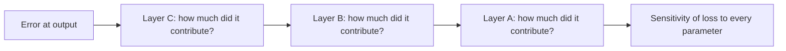
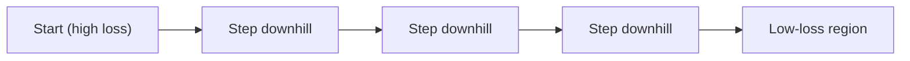
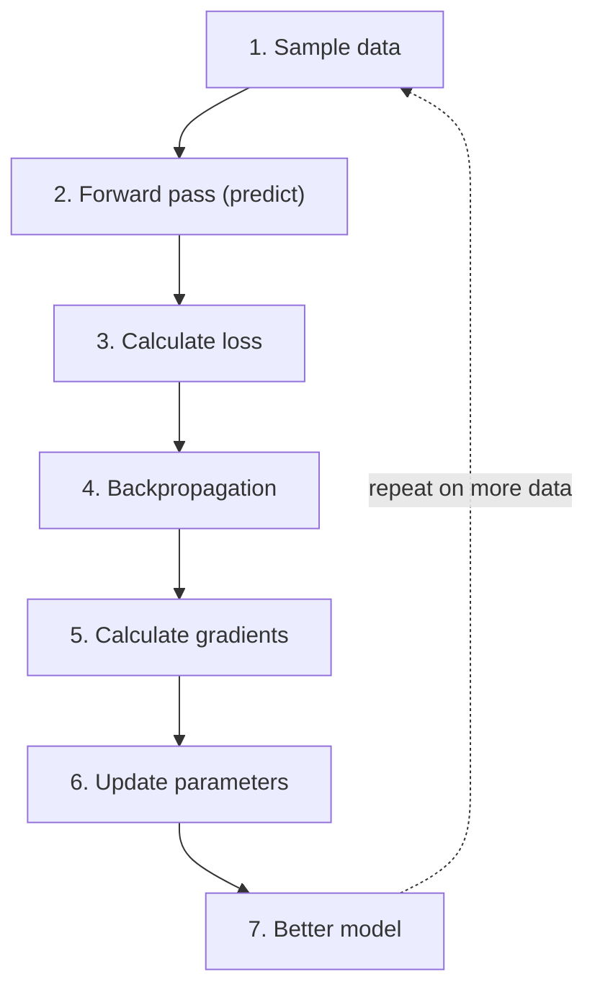

> **Season 1 — Inside the Mind of AI** [🔗](./README.md)

# Episode 07: Sharpening the Brain

> In the last episode we opened the brain and saw how a *trained* model predicts the next token. This episode asks the deeper question: how does an untrained brain become a good one? The answer is **training** — and training is just the repeated, careful adjustment of a huge collection of numbers called **parameters**.

> **A useful question:** If a neural network is "just numbers," what does it actually mean for a machine to *learn*?

---

<details id="at-a-glance" style="margin-bottom: 1rem;">
<summary><strong style="font-size: 1.25em;">👀 At a Glance</strong></summary>
<div style="margin-left: 3rem; margin-top: .25rem;">

| Question | Short answer |
|:---|:---|
| What does "learning" mean for a machine? | Adjusting **parameters** so future predictions get better |
| What are parameters? | A huge collection of adjustable numbers (weights and biases) inside the network |
| How big are they? | GPT-3 had **175 billion**; newer models are estimated in the trillions |
| Do parameters store knowledge? | Not as memory — they are stateless numbers with **patterns** learned from data |
| How do we measure a bad prediction? | A **loss function** turns prediction quality into a single number |
| How do we know which numbers to change? | **Backpropagation** works backward from the error to find each parameter's effect |
| How do we actually change them? | **Gradient descent** nudges each parameter against its gradient, sized by the **learning rate** |
| What is the whole loop? | Sample → forward pass → loss → backprop → gradients → update → repeat |
| Training vs. inference? | Training *changes* the model; inference just *uses* it |
| Can the model do new things? | **Generalization** = good on unseen data. **Overfitting** = great on training data, bad on new data |
| How does it learn progressively? | Word sequences → grammar → context → long-range relationships |

</div>
</details>

---

<details id="quick-notes" style="margin-bottom: 1rem;">
<summary><strong style="font-size: 1.25em;">📝 Quick Notes — visual revision</strong></summary>
<div style="margin-left: 3rem; margin-top: .25rem; min-height: 1rem;">&nbsp;</div>
</details>

---

<details id="what-learning-means" open style="margin-bottom: 1rem;">
<summary><strong style="font-size: 1.25em;">🧠 What Does "Learning" Actually Mean?</strong></summary>
<div style="margin-left: 3rem; margin-top: .25rem;">

### Trained vs. untrained

🔁 In [Episode 06](./episode-06-the-computational-brain-of-machines.md) we *assumed* the neural network was already trained — that is why "the pizza is" confidently predicted "ready." This episode flips that assumption. We start with an **untrained** network and ask how it becomes good.

An untrained network has no idea what comes next. Feed it "the sky is" and it might say **potato**, **banana**, **cool**, or **magic** — anything at all. A well-trained network, by contrast, leans hard toward **blue**. The difference between those two behaviors is exactly what training produces.

👶 Think of an untrained model like a **newborn child**: it has not yet learned anything about the world, so to it everything is equally possible. Training is the long process of that "child" learning — slowly, from experience, until its guesses start matching reality.

> **Untrained → random, meaningless output. Trained → meaningful, likely output.** Training is the process that moves a model from the first to the second.

### The one-sentence definition

🧠 Here is the whole idea in plain English. Read it slowly:

> **A neural network contains a huge amount of adjustable numbers, called parameters. During training, we repeatedly modify those parameters so that the model becomes better at a particular objective.**

For a language model, that objective is simple: **predict the next token better.** So "learning" is not some mysterious process — it is the act of **adjusting parameters** until future predictions improve.

### The knob analogy

🎛️ Picture a giant mixing console with **millions and billions of knobs**. Each knob is one parameter. Turn one knob a little and the output gets slightly better or slightly worse. Training is the slow, precise act of turning *all* of those knobs — some up, some down — until the sound (the output) comes out clean.

It is a lot like tuning an old radio: you rotate the dial until you land on the exact frequency where the channel is clear. A neural network has an almost incomprehensible number of such dials, and training finds the setting where the "signal" (the correct next token) comes through.

> 🧭 **If you remember one thing from this section:** *learning = adjusting parameters.* Everything else in this episode is about **how** we decide which parameters to move, and by how much.

</div>
</details>

---

<details id="parameters" style="margin-bottom: 1rem;">
<summary><strong style="font-size: 1.25em;">🔢 Parameters: The Adjustable Numbers</strong></summary>
<div style="margin-left: 3rem; margin-top: .25rem;">

### What parameters are

🔢 **Parameters are the learned numerical values that determine the model's behavior.** They are not text, not rules, not a database — they are just numbers. When input flows through the network, it is combined with these numbers through a lot of arithmetic (dot products, matrix multiplications), and the result is the output.

Patterns and knowledge learned during training are **encoded across** these parameters. That is why the same network, with different parameter values, behaves completely differently.

### How big is "huge"?

📏 The scale is hard to feel, so here are some anchors:

| Model | Parameters | Note |
|:---|:---:|:---|
| **GPT-3** | **175 billion** | Publicly announced by OpenAI |
| **GPT-4 / GPT-5** | Not officially disclosed | Researchers estimate **hundreds of billions to trillions** |

> ⚠️ **Needs verification:** Exact parameter counts for GPT-4 and later models are **not officially published**. Figures like "1.8 trillion" circulate online but are estimates, not confirmed numbers. Treat them as "very large," not as fact.

### Where do parameters live? (mapping back to Episode 06)

🗺️ You already met most of these in the [architecture walkthrough](./episode-06-the-computational-brain-of-machines.md). Every one of these boxes is full of parameters:

| Part of the network | Parameters it holds |
|:---|:---|
| **Embedding table** | A vector for every token in the vocabulary |
| **Self-attention** | The **Q, K, V** weight matrices and the **output (O)** projection |
| **Layer Norm** | The **scale (γ)** and **shift (β)** values |
| **Feed-forward (MLP)** | The **projection weights** and **biases** |

> 🧩 **The punchline:** an LLM, at its core, *is* a very large collection of numbers. "The model" you download is essentially this set of adjusted parameters. When a company says "a 70-billion-parameter model," it is counting exactly these numbers. And it goes deeper than that — the *machine* itself, at the most micro level, is just numbers (binary). The AI, the hardware, the computation: it is all numbers doing arithmetic on numbers.

> 💡 **"Weights" and "parameters" are the same thing.** You will hear both terms used interchangeably — "adjusting the weights," "tuning the parameters." They refer to the exact same numbers. Do not get confused by the two names.

</div>
</details>

---

<details id="do-parameters-store-knowledge" style="margin-bottom: 1rem;">
<summary><strong style="font-size: 1.25em;">🧩 Do Parameters Store Knowledge?</strong></summary>
<div style="margin-left: 3rem; margin-top: .25rem;">

🧩 This is a favorite interview question, and the precise answer matters:

> **Parameters do not store knowledge the way a database or a memory does.** They are **stateless numbers** — a list of values with no built-in meaning. But they contain **patterns** that were learned from training data, and those patterns let the model produce knowledgeable-looking output when you feed it input.

Think of them as **knowledge enablers**, not a knowledge store. The model does not "remember" a fact it can look up; it has shaped its numbers so that, given the right input, the arithmetic lands on a sensible answer.

### A clean way to answer it

If asked *"do parameters store knowledge?"*, a strong answer is:

> "They don't have memory or store facts directly. They are just numbers, but those numbers have patterns learned from training data. When input is combined with them, the math produces the right output."

> ⚠️ **Watch the wording.** Saying "the model *knows* X" is loose. Saying "the model's parameters are tuned so it *predicts* X well" is more accurate — and it keeps you honest about the difference between *knowing* and *predicting* (a theme from [Episode 03](./episode-03-does-chatgpt-know-or-does-it-guess.md)).

</div>
</details>

---

<details id="training-data" style="margin-bottom: 1rem;">
<summary><strong style="font-size: 1.25em;">📚 Training Data: Where the Patterns Come From</strong></summary>
<div style="margin-left: 3rem; margin-top: .25rem;">

📚 **Training data is the data you feed into the model to make it smart.** It is *separate* from the parameters — parameters live *inside* the network; training data is what you *pass in*.

To build a large language model, you gather an enormous amount of public text — web pages, articles, books, code, and more — and convert it into **tokens**. Those tokens are fed through the network, and the network's parameters are adjusted to match what actually comes next in the text.

```text
Training data (text)  ->  tokens  ->  fed into the network  ->  parameters get adjusted
```

### Data cleaning

🧹 Raw data from the internet cannot be fed in directly. Before training, it goes through a **cleaning** process: removing duplicates, filtering out low-quality or harmful content, and deciding what to include. Companies are very careful about *what* they train on — you do not want the model learning from fake news, hate speech, or misinformation, because it would then generate that kind of content. The quality of the training data directly shapes the quality of the model.

> 🧭 **Keep the two things straight:** *training data* = the input you give it. *parameters* = the internal numbers that change as a result. Confusing them is the most common mistake at this stage.

</div>
</details>

---

<details id="forward-pass" style="margin-bottom: 1rem;">
<summary><strong style="font-size: 1.25em;">➡️ The Forward Pass</strong></summary>
<div style="margin-left: 3rem; margin-top: .25rem;">

➡️ The **forward pass** is the same pipeline you saw in [Episode 06](./episode-06-the-computational-brain-of-machines.md): input goes in, flows through the Transformer blocks, and a probability for every token comes out. The architecture does not change during training — what changes is the *values* of the parameters inside it.

With an **untrained** network, the initial parameters are essentially **random numbers**, so the forward pass produces a nonsense distribution. For "the sky is," it might look like:

| Candidate next token | Untrained probability |
|:---|:---:|
| banana | 0.85 |
| green | 0.61 |
| blue | 0.20 |
| beautiful | 0.55 |
| best | 0.15 |

Notice that **banana** is winning, even though "the sky is banana" makes no sense. That is the signature of an untrained model: the numbers have not been shaped yet.

### A second example: token by token

📝 Training data flows through the model **one token at a time**. Say the training text contains:

> "born and raised in New Zealand"

The model sees "born and raised in New" and must predict the next token. The correct answer (from the data) is **Zealand**. An untrained model might predict something random. But because the training data *tells* it the answer, the model can compare its guess to "Zealand," calculate the loss, and nudge the parameters. The next token is then appended, and the process repeats for the following token. This is how an entire sentence — and eventually an entire dataset — trains the model, one small prediction at a time.

> 🧭 **The forward pass is the "make a prediction" step.** Training is built around it: predict, check how wrong you were, then adjust.

</div>
</details>

---

<details id="training-vs-inference" style="margin-bottom: 1rem;">
<summary><strong style="font-size: 1.25em;">⚖️ Training vs. Inference</strong></summary>
<div style="margin-left: 3rem; margin-top: .25rem;">

⚖️ The same Transformer architecture is used in both **training** and **inference**, but they do very different things with it:

| | Training | Inference |
|:---|:---|:---|
| **Goal** | Improve the model | Use the model |
| **What happens after prediction** | Calculate loss → backprop → update parameters | Just append the token to the output |
| **Does it change the model?** | Yes, continuously | No |
| **Cost** | Very expensive (many GPUs, lots of power) | Relatively cheap (one pass, one token) |
| **Speed** | Slow (predict + backprop + update, repeated) | Fast (one forward pass per token) |

🎸 Think of it like a **guitar**: *training* is tuning the strings — adjusting each one until the instrument plays in tune. *Inference* is playing the guitar — the strings are already tuned, you just strum and get music. Tuning takes time and effort; playing is quick and easy.

> 🧭 **In one line:** training *changes* the model; inference *uses* the model. That is the entire difference.

</div>
</details>

---

<details id="loss-function" style="margin-bottom: 1rem;">
<summary><strong style="font-size: 1.25em;">📉 The Loss Function: Measuring How Wrong We Are</strong></summary>
<div style="margin-left: 3rem; margin-top: .25rem;">

📉 To improve, the model first needs a number that says *how bad* its prediction was. That number is the **loss**.

> **A loss function is a numerical way to measure how bad the prediction is.** It converts the quality of a prediction into a single number.

Because we have the training data, we already know the *correct* next token. The loss function compares the model's prediction against that correct answer:

- **Correct prediction → small loss** (near zero if it nailed it)
- **Very wrong prediction → large loss**

### A concrete example

Suppose the correct answer is **blue**. Compare two predictions:

| | Prediction A | Prediction B |
|:---|:---:|:---:|
| blue | 90% | 2% |
| banana | low | 80% |
| **Loss** | **Low** ✅ | **High** ❌ |

In **Prediction A**, the model put most of its confidence on the right token, so the loss is small. In **Prediction B**, it put 80% on *banana* and only 2% on *blue*, so the loss is large — a clear signal that the parameters need adjusting.

> 🧭 **The loss is the model's report card.** Big loss = "you were wrong, fix the parameters." Small loss = "you were close, keep going."

</div>
</details>

---

<details id="backpropagation" style="margin-bottom: 1rem;">
<summary><strong style="font-size: 1.25em;">⬅️ Backpropagation: Finding the Culprits</strong></summary>
<div style="margin-left: 3rem; margin-top: .25rem;">

⬅️ Now the hard question. There may be **billions** of parameters. When the prediction is wrong:

- **Which** parameters were responsible for the mistake?
- **How** should each one change?

We cannot just nudge all of them blindly. **Backpropagation** (short for *backward propagation of the error*) is the technique that answers both.

### The idea

🔙 Backpropagation starts from the **error at the output** and works **backward** through the network, layer by layer. It asks, in sequence:

- How much did the last layer contribute to the error?
- How much did each weight in that layer contribute?
- What about the layer before it? And its weights?
- …all the way back to the first layer.

The result is the **sensitivity of the loss to each parameter** — a number that says "if you nudge *this* parameter, the loss changes by *this* amount."



> ⚠️ **Common misconception:** backpropagation does **not** update the weights. It only *calculates* how each parameter affects the loss. The actual updating is done by a separate step (gradient descent, next section).

</div>
</details>

---

<details id="gradient" style="margin-bottom: 1rem;">
<summary><strong style="font-size: 1.25em;">📐 The Gradient: Which Way to Move</strong></summary>
<div style="margin-left: 3rem; margin-top: .25rem;">

📐 The numbers backpropagation produces are called **gradients**. A **gradient** tells you two things about a parameter:

1. **How sensitive** the loss is to that parameter (the size).
2. **Which direction** moving it will change the loss (the sign).

### A tiny example

Imagine a particular weight is currently **0.40**. Its gradient says: *"increasing this weight will increase the loss."* So to reduce the loss, we should nudge this weight slightly **downward**. Another weight's gradient might say the opposite — that one should move **upward**.

> 🧭 **The rule of thumb:** move each parameter in the direction that *lowers* the loss. The gradient tells you which way that is.

### The important distinction

| Step | What it does |
|:---|:---|
| **Backpropagation** | Calculates the **gradients** (how each parameter affects the loss) |
| **Optimization algorithm** | Uses those gradients to **actually update** the parameters |

Backprop gives the *information*; the optimizer takes the *action*. Keeping these two separate is the key to not getting confused.

</div>
</details>

---

<details id="gradient-descent" style="margin-bottom: 1rem;">
<summary><strong style="font-size: 1.25em;">⛰️ Gradient Descent: Taking the Steps</strong></summary>
<div style="margin-left: 3rem; margin-top: .25rem;">

⛰️ **Gradient descent** is the iterative optimization algorithm that actually moves the parameters. Its job is to **minimize the loss** by adjusting parameters in the **opposite direction of their gradients**.

### The mountain analogy

🥾 Imagine you are standing on a foggy mountain and want to reach the lowest point (the minimum loss). You cannot see the whole mountain, but you can feel the slope under your feet. The **gradient** points in the direction of **steepest increase** — uphill. So to get *down*, you step in the **opposite** direction.

Take a small step, feel the new slope, take another step, repeat. Eventually you settle into a low-loss region. That is gradient descent.



### The three core concepts

| Concept | Role |
|:---|:---|
| **Loss function** | Defines what "bad" means (the thing we minimize) |
| **Gradient** | Points the direction of steepest increase |
| **Learning rate** | Sets **how big a step** we take each update |

### The learning rate

🎚️ The **learning rate** controls the step size. It is one of the most important settings in training:

- **Too large** → you overshoot the minimum and the loss bounces around or even explodes.
- **Too small** → you crawl; training takes forever to make progress.
- **Just right** → steady, reliable descent toward a low loss.

### Main variants

How much data you use per step gives three common flavors:

| Type | Data used per update | Trade-off |
|:---|:---|:---|
| **Batch Gradient Descent** | The *entire* dataset | Accurate direction, but very slow per step |
| **Stochastic Gradient Descent (SGD)** | *One* sample at a time | Fast, noisy updates |
| **Mini-batch Gradient Descent** | A *small batch* of samples | The practical middle ground — most training uses this |

> 🧭 **In practice**, large models are trained with **mini-batch** gradient descent, often with a smarter optimizer (like Adam) that adapts the effective step size per parameter.

### Challenges of gradient descent

⚠️ The mountain is not always a smooth slope. Three common problems:

| Challenge | What happens |
|:---|:---|
| **Learning rate too small** | Steps are tiny; training takes forever to make progress |
| **Learning rate too large** | Steps overshoot the minimum; the loss bounces around and never converges |
| **Local minima / saddle points** | The slope goes flat (a plateau or a small dip). The model gets *stuck* because there is no downhill direction to follow |

> 🧭 **The goal is to find the right learning rate** — big enough to make progress, small enough to not overshoot. In practice, optimizers like Adam and techniques like learning-rate scheduling help navigate these rough terrains.

</div>
</details>

---

<details id="training-loop" style="margin-bottom: 1rem;">
<summary><strong style="font-size: 1.25em;">🔁 The Training Loop</strong></summary>
<div style="margin-left: 3rem; margin-top: .25rem;">

🔁 Put all the pieces together and training is a loop that runs over and over, on a huge amount of data:



Each cycle makes the parameters a *little* better. Run it across **enormous** amounts of data and the small improvements compound into a model that predicts the next token well.

### What is a "sample"?

🩸 A **sample** is a small piece of input you pass to the model to test it — like a **blood sample** you give a doctor. You already know the correct answer (the training data tells you), so you are not really "asking" the model a question. You are *testing* it: "Given this input, what do you predict?" If the prediction matches the known answer, the sample passes. If not, the model needs to adjust.

A **training step** is one full cycle of this: one prediction + one parameter update. Training a model means running *billions* of training steps.

> 🧭 **Sample = one test input. Training step = one predict-and-update cycle. Forward pass = one attempt to predict one token.** These are the building blocks.

### Why repetition is what does the work

🔁 Consider the phrase **"the sky is blue."** It appears *millions* of times across the internet. Every single time that phrase shows up in the training data, the model sees "the sky is" and is nudged a tiny bit toward making **blue** the expected next token. One occurrence barely moves the needle — but millions of them, each making a microscopic adjustment, add up until "blue" is the obvious prediction.

That is the whole mechanism in miniature: no single example teaches the model anything on its own. It is the **accumulation of countless tiny nudges** across a huge dataset that shapes the parameters into something that "knows" the sky is blue.

> 🧭 **The loop is the whole story:** *predict → measure the error → find the gradients → nudge the parameters → repeat.* Everything in this episode is one part of that loop.

</div>
</details>

---

<details id="self-supervised" style="margin-bottom: 1rem;">
<summary><strong style="font-size: 1.25em;">🪞 Self-Supervised Learning</strong></summary>
<div style="margin-left: 3rem; margin-top: .25rem;">

🪞 A striking thing about this training setup: **we do not need a human to label the data.** The model learns from the data *itself*.

The trick is that the **next token becomes the target**. Given a piece of text, the model predicts what comes next, and the *actual* next token in the training data is the correct answer — for free.

```text
"The sky is ___"   ->  model predicts the next token
                     ->  the real next token in the data is the target
```

Because every stretch of text gives you a prediction task automatically, you can train on *all* the text in the world without anyone writing a single label. This is called **self-supervised learning**, and it is a big reason modern LLMs can be trained on such massive data.

> 🧭 **Why it matters:** the "supervision" (the correct answer) is built into the data itself, so the amount of usable training signal is essentially unlimited.

</div>
</details>

---

<details id="key-idea" style="margin-bottom: 1rem;">
<summary><strong style="font-size: 1.25em;">🌱 The Key Idea: Learning Is Repeated Optimization</strong></summary>
<div style="margin-left: 3rem; margin-top: .25rem;">

🌱 The single most important takeaway: **a neural network does not learn a concept from one weight update.** Useful behavior does not appear in a single step.

It **emerges through repeated optimization.** Again and again:

> **Predict → calculate loss → backpropagate → calculate gradients → update parameters**

Each pass moves the parameters a little. After enough passes over enough data, the parameters settle into values that encode the patterns of the training data — and the model starts making genuinely good predictions.

> 🧭 **One line to carry forward:** *training is not a single event, it is a loop run billions of times until the numbers are shaped just right.*

### The model is never "perfect"

🔍 Just like a human brain can never be perfect, a trained model will **always have some loss**. There will always be a few predictions it gets wrong. The goal is not zero loss — it is *low enough* loss that the model is useful. Whether a truly zero-loss model is even possible is an open question.

</div>
</details>

---

<details id="progressive-learning" style="margin-bottom: 1rem;">
<summary><strong style="font-size: 1.25em;">📈 How the Model Learns (Progressively)</strong></summary>
<div style="margin-left: 3rem; margin-top: .25rem;">

📈 A model does not learn everything at once. As training progresses, it picks up capabilities in rough stages:

| Stage | What the model learns | Example |
|:---|:---|:---|
| **1. Word sequences** | Which words tend to follow which | "this is" → "a"; "I" → "am" |
| **2. Grammar** | Sentence structure, subject-verb agreement, singular/plural | "you are" vs. "he is"; "a" before vowel sounds |
| **3. Context & meaning** | What a word refers to, using attention | "The cat sat on the mat because **it** was tired" → "it" = cat |
| **4. Long-range relationships** | Connecting ideas across a whole paragraph or document | Understanding a multi-paragraph essay about the Constitution of India |

Nobody is *teaching* the model any of this. It emerges automatically from the mathematics, as the parameters are adjusted over and over on more and more data. The more diverse the data (code, poetry, history, science, social media), the richer the patterns become.

> 🧭 **The Transformer's special power:** unlike older models, it uses **attention** to understand *context* — not just "what word comes next" but "what does this word *mean* given everything around it." That is why it can resolve references, disambiguate words, and follow long arguments.

</div>
</details>

---

<details id="human-analogy" style="margin-bottom: 1rem;">
<summary><strong style="font-size: 1.25em;">🧑‍🏫 How This Is Like How Humans Learn</strong></summary>
<div style="margin-left: 3rem; margin-top: .25rem;">

🧑‍🏫 If I say "honesty is the best ___," you instantly say "policy." How did you learn that? You heard or read that phrase *millions* of times. Your brain adjusted its internal connections (neurons firing together) until the pattern was solid. A machine does the same thing — it just does it with numbers instead of neurons.

| Humans | Machines |
|:---|:---|
| Neurons connect and strengthen with repetition | Parameters are nudged with each training step |
| You learn grammar by reading thousands of sentences | The model learns grammar from billions of tokens |
| You get tired; you stop reading | The model does not rest; it keeps consuming data |
| You have *memory* (you remember specific events) | The model is *stateless* (no memory between predictions) |
| You *understand* (debatable) | The model *predicts* (see the [understanding section](#understanding)) |

The parallel is real but superficial. A human brain is vastly more complex than any neural network. But the *philosophy* is the same: **repetition + pattern recognition = learning.** The more books you read, the better your mind becomes. The more data a model trains on, the better its predictions become.

> 🧭 **The key difference:** humans have memory and (arguably) understanding. Machines have neither — they have patterns encoded in numbers, and nothing more.

</div>
</details>

---

<details id="key-terms" style="margin-bottom: 1rem;">
<summary><strong style="font-size: 1.25em;">📖 Key Terms You Will Hear Everywhere</strong></summary>
<div style="margin-left: 3rem; margin-top: .25rem;">

📖 These are industry jargon. When you read a blog post or sit in an interview, these words will come up. Know what they mean:

| Term | Meaning |
|:---|:---|
| **Dataset** | All the training examples — everything you feed into the model |
| **Sample** | One small piece of input used to test/train the model (like a blood sample) |
| **Batch** | A *group* of examples processed together (not one at a time) |
| **Training step** | One optimization update: one prediction + one parameter adjustment |
| **Forward pass** | One attempt by the model to predict the next token |
| **Loss function** | The number that measures how wrong the prediction was |
| **Backpropagation** | Working backward to find which parameters caused the error |
| **Gradient** | The sensitivity of the loss to each parameter (direction + magnitude) |
| **Learning rate** | How big a step the optimizer takes per update |
| **Gradient descent** | The algorithm that uses gradients to update parameters |
| **Context window** | The maximum number of tokens the model can consider at once (it has a limit) |

> 🧭 **Why it matters:** you can understand all the concepts and still fumble in an interview if you do not know the exact keywords. These are the words the industry uses.

</div>
</details>

---

<details id="generalization" style="margin-bottom: 1rem;">
<summary><strong style="font-size: 1.25em;">🎯 Generalization and Overfitting</strong></summary>
<div style="margin-left: 3rem; margin-top: .25rem;">

### Generalization

🎯 Suppose the training data contains **"the sky is blue," "the ocean is blue," "the grass is green," "the leaves are green."** All of it flows through the network and shapes the parameters. Now show the model a sentence it has *never* seen:

> "On a clear afternoon, the sky looked so ___"

That exact sentence was not in the training data. Can the model still fill in **blue**? If it can, it has **generalized**.

> **Generalization is the ability to perform well on examples the model did not directly memorize.**

It works because the model learned *patterns*, not just specific sentences. It has seen that **sky** and **blue** tend to go together (remember the semantic similarity and cosine similarity from [Episode 05](./episode-05-how-machines-represent-meaning.md)?), and it has learned the grammar around words like "looked so." So even on a brand-new sentence, the patterns point it toward the right answer.

### Good learning

🌱 **Good learning means discovering patterns that remain useful beyond the exact training examples.** A model has learned well when it can produce good output on data it has *not* seen before, using the patterns it picked up. In short: a useful model should **generalize** — work well on both the repeated samples *and* the new ones.

### Overfitting (the opposite)

⚠️ **A model is overfitting when it becomes extremely good at its training examples but performs poorly on new ones.** It is the exact opposite of generalization.

Imagine training on "the sky is blue" **10,000 times**. The model becomes brilliant at that one phrase — feed it "the sky is" and it says "blue" every time. But it has simply *memorized* the sequence (the → sky → is → blue). Now give it "on a clear summer afternoon, the sky appeared ___" and it fails. That is overfitting: excellent on the training data, useless on anything new.

| | Generalization ✅ | Overfitting ❌ |
|:---|:---|:---|
| Training examples | Good | Extremely good |
| New examples | Good | Poor |
| What it learned | Useful patterns | Memorized the exact data |

> 🧭 **Two lines to remember:** *generalization = good on new examples. Overfitting = great on training data, bad on new data.* These are interview keywords — knowing the concept is not enough, you need the exact words.

</div>
</details>

---

<details id="distributed-training" style="margin-bottom: 1rem;">
<summary><strong style="font-size: 1.25em;">🌐 Distributed Training</strong></summary>
<div style="margin-left: 3rem; margin-top: .25rem;">

🌐 Training a frontier-scale model is **a large distributed-systems problem as much as it is a machine-learning problem.**

Think about why. You cannot train *sequentially* — reading the internet one line at a time, one paragraph at a time. New content is created faster than a single machine could ever consume it, so the model would never finish learning. Instead, the training runs **in parallel** across a huge cluster of machines (GPUs), which is a massive engineering challenge in its own right.

Several forces are what make today's LLMs possible, and they keep improving together:

| Force | What is improving |
|:---|:---|
| **Hardware** | GPUs (like the H100) get faster and more capable; you can even rent them to run your own models |
| **Data** | The internet keeps expanding, giving more training signal |
| **Algorithms** | Better architectures and optimization techniques (the Transformer being one big leap) |
| **Distributed systems** | The ability to coordinate thousands of GPUs working in parallel |

> 🧭 **The point:** building a big model is not just "write the math." It is also a huge systems problem — getting the compute, the data, and the parallelism all to work together. Research on all of these keeps pushing the limits.

</div>
</details>

---

<details id="embeddings-learned" style="margin-bottom: 1rem;">
<summary><strong style="font-size: 1.25em;">🔄 Embeddings Are Learned, Too</strong></summary>
<div style="margin-left: 3rem; margin-top: .25rem;">

🔄 This completes a circle we started back in [Episode 05](./episode-05-how-machines-represent-meaning.md). Remember the token embeddings — **king** represented by one vector, **queen** by another? At the time it may have looked like those numbers were placed there by magic. Now you know the truth:

> **The embedding values are parameters too.** When a model is brand new and untrained, they are just **random numbers**. Nobody manually sets "king" next to "queen."

As training runs, backpropagation adjusts the embeddings along with every other parameter. Because the data keeps showing **king** and **queen** in similar contexts, the model is *forced* to move their vectors closer together — that is the only way to make its predictions (and thus its loss) better. After enough samples, the relationship appears **automatically**.

```text
Before training:  king = [random]   queen = [random]   (no meaningful relation)
After training:   king ≈ queen      (vectors drift close, because the data links them)
```

> 🧭 **Why embeddings change:** *better representations help the network make better predictions.* The king/queen vectors end up close not because a human arranged them, but because that arrangement lowers the loss. The patterns evolve on their own — no one is placing anything by hand.

</div>
</details>

---

<details id="understanding" style="margin-bottom: 1rem;">
<summary><strong style="font-size: 1.25em;">🤔 Does the Model Actually Understand?</strong></summary>
<div style="margin-left: 3rem; margin-top: .25rem;">

🤔 A philosophical question worth sitting with: **we say a model "learns," but does it actually *understand*?**

Humans learn *and* understand. A model, at its core, is doing **prediction** — matrix multiplications and dot products through Transformer layers. It does not even work with "words"; it works with **tokens**, and a word like "impossible" may be split into several subword pieces it has no human sense of. So when you tell it "I am sad," it predicts a fitting response from learned patterns — but does it *feel* or *understand* the sadness?

> **Prediction is not understanding** — at least not in the human sense. That is one perspective, and it is genuinely debatable.

| Perspective | The argument |
|:---|:---|
| **"It understands"** | It responds the way a person would to someone who is sad — so functionally, it "gets it" |
| **"It does not"** | It is only doing mathematics on tokens; there is no inner experience or meaning |

The honest answer is: **we do not know**, because we do not even have a clear definition of "understanding." Related open questions — can a machine ever have *feelings* or *consciousness*? — are part of the same debate.

> 🧭 **This is out of syllabus** — a personal, philosophical thought to chew on, not a fact to memorize. The course's position is simple: the model is a prediction machine, and whether prediction ever becomes "understanding" is an open question.

</div>
</details>

---

<details id="mental-model" style="margin-bottom: 1rem;">
<summary><strong style="font-size: 1.25em;">💡 My Mental Model</strong></summary>
<div style="margin-left: 3rem; margin-top: .25rem;">

🎛️ I picture training like tuning a giant instrument. The model starts as a wall of knobs set to random positions, so it plays pure noise ("the sky is banana"). Each training step is: play a note, listen to how off it sounds (the loss), figure out which knobs are off (backprop), and turn each one a hair (gradient descent). No single turn fixes the song — but after billions of tiny turns, the noise resolves into music.

The part that keeps clicking for me is how *un-magical* it is. There is no memory, no stored facts, no rulebook. Just numbers, a way to measure how wrong they are, and a way to nudge them the right way — repeated until the patterns show up. Once you see it that way, "the model learned" just means "the numbers got tuned."

</div>
</details>

---

## Key Takeaways

- **Learning = adjusting parameters** — repeated optimization (predict → loss → backprop → gradients → update) run billions of times until the numbers are shaped just right. [🔗](#what-learning-means)
- **Parameters are just numbers** (weights and biases) in the embeddings, attention, layer norm, and feed-forward layers — they don't store knowledge, they hold patterns learned from data. [🔗](#parameters)
- **The loss function** turns "how wrong was the prediction?" into a single number: small loss = good, large loss = bad. [🔗](#loss-function)
- **Backpropagation** works backward to find how each parameter affects the loss (it does *not* update the weights); **gradient descent** then takes the step, sized by the **learning rate**. [🔗](#backpropagation)
- **Training changes the model; inference just uses it.** Training is expensive and slow; inference is one fast pass. [🔗](#training-vs-inference)
- **Generalization** = performing well on unseen data. **Overfitting** = memorizing training data and failing on new examples. [🔗](#generalization)
- **Self-supervised learning** needs no labels — the next token in the data is the target. [🔗](#self-supervised)

## Questions / Things to Explore

- How do optimizers like **Adam** improve on plain gradient descent?
- What is a **saddle point**, and how is it different from a local minimum?
- How does the model decide *when* to stop generating (emit an end-of-sequence token)?
- What is **underfitting**, and how is it different from overfitting?
- How does the **context window** limit affect what the model can learn and generate? [🔗](./episode-04-the-secret-language-of-llms.md#context-window)

---

| ← Previous | Next → |
|:---:|:---:|
| [Episode 06: The Computational Brain of Machines](./episode-06-the-computational-brain-of-machines.md) | _coming soon_ |
